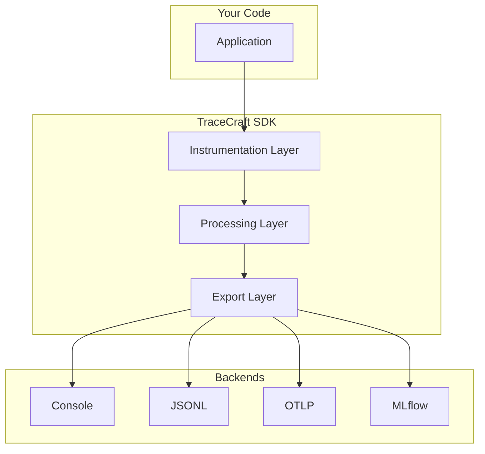
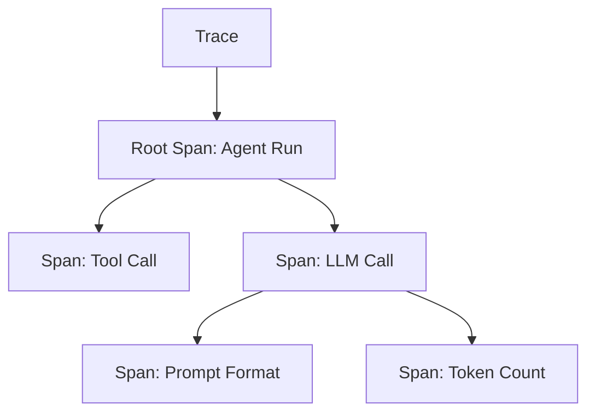
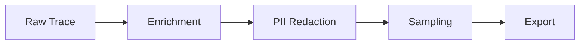

# Core Concepts

Understanding the core concepts of TraceCraft will help you use it effectively.

## Architectural Overview

TraceCraft is built on three main layers:



### 1. Instrumentation Layer

Captures telemetry data from your application:

- **Decorators**: `@trace_agent`, `@trace_tool`, `@trace_llm`, `@trace_retrieval`
- **Context Managers**: `step()`, `runtime.run()`
- **Framework Adapters**: LangChain, LlamaIndex, PydanticAI integrations
- **Auto-Instrumentation**: Automatic OpenAI/Anthropic SDK tracing

### 2. Processing Layer

Transforms and filters trace data:

- **PII Redaction**: Remove sensitive information
- **Sampling**: Control trace volume
- **Enrichment**: Add metadata and context

### 3. Export Layer

Sends processed traces to destinations:

- **Console**: Rich terminal output
- **JSONL**: Local file storage
- **OTLP**: OpenTelemetry Protocol (Jaeger, Grafana, etc.)
- **MLflow**: Experiment tracking
- **Custom**: Build your own exporters

## Key Concepts

### Traces and Spans

TraceCraft follows OpenTelemetry's trace model:



- **Trace**: A complete execution path through your application
- **Span**: A single operation within a trace (function call, LLM invocation, etc.)
- **Root Span**: The top-level span representing the entire agent run

### Agent Runs

An **Agent Run** represents a complete interaction with your AI system:

```python
from tracecraft import TraceCraftRuntime

runtime = tracecraft.init()

# Explicit run creation
with runtime.run("user_query_123"):
    response = await agent(user_input)

# Or automatic run creation via decorators
@trace_agent(name="agent")
async def agent(input: str):
    # Automatically creates a run if not in one
    ...
```

Key properties of a run:

- Unique `run_id`
- Start and end timestamps
- Status (success, error)
- All child spans
- Metadata and tags

### Step Types

TraceCraft categorizes operations into semantic types:

```python
from tracecraft.core.models import StepType

StepType.AGENT      # Agent or workflow orchestration
StepType.TOOL       # Tool or function execution
StepType.LLM        # LLM API calls
StepType.RETRIEVAL  # Vector search, RAG retrieval
StepType.WORKFLOW   # General workflow steps
```

These types help backends understand your trace semantics.

### Decorators

TraceCraft provides specialized decorators for each step type:

#### @trace_agent

For agent functions that orchestrate complex workflows:

```python
from tracecraft import trace_agent

@trace_agent(name="research_agent")
async def research(query: str) -> str:
    """Agent that coordinates research tasks."""
    results = await search(query)
    return await summarize(results)
```

**Captures:**

- Function name and inputs/outputs
- Execution time
- Child spans (tools, LLMs called)
- Errors and stack traces

#### @trace_tool

For tool or utility functions:

```python
from tracecraft import trace_tool

@trace_tool(name="calculator")
def calculate(expression: str) -> float:
    """Tool for math calculations."""
    return eval(expression)
```

**Captures:**

- Tool name and description
- Inputs and outputs
- Execution time
- Success/failure status

#### @trace_llm

For LLM API calls:

```python
from tracecraft import trace_llm

@trace_llm(name="chat", model="gpt-4", provider="openai")
async def chat(prompt: str) -> str:
    """Call GPT-4."""
    response = await openai.chat.completions.create(
        model="gpt-4",
        messages=[{"role": "user", "content": prompt}]
    )
    return response.choices[0].message.content
```

**Captures:**

- Model name and provider
- Prompt and completion
- Token counts
- Latency and throughput
- Costs (if available)

#### @trace_retrieval

For retrieval operations (RAG, vector search):

```python
from tracecraft import trace_retrieval

@trace_retrieval(name="vector_search")
async def search(query: str, top_k: int = 5) -> list[str]:
    """Search vector database."""
    results = await vector_db.search(query, limit=top_k)
    return results
```

**Captures:**

- Query text
- Number of results
- Relevance scores
- Retrieved documents

### Context Managers

For fine-grained control, use context managers:

```python
from tracecraft import step
from tracecraft.core.models import StepType

async def complex_workflow(data):
    # Manual span creation
    with step("preprocessing", type=StepType.WORKFLOW) as s:
        cleaned = preprocess(data)
        s.attributes["rows_processed"] = len(cleaned)

    with step("inference", type=StepType.LLM) as s:
        result = await model.predict(cleaned)
        s.outputs["prediction"] = result

    with step("postprocessing", type=StepType.WORKFLOW) as s:
        final = postprocess(result)
        s.outputs["final_result"] = final

    return final
```

### Runtime

The **Runtime** manages the lifecycle of tracing:

```python
from tracecraft import TraceCraftRuntime, TraceCraftConfig

# Create a runtime with custom config
runtime = TraceCraftRuntime(
    config=TraceCraftConfig(
        service_name="my-service",
        console=True,
        jsonl=True,
    )
)

# Use the runtime
with runtime.run("my_run"):
    result = await my_agent("input")
```

Multiple runtimes can coexist (useful for multi-tenancy):

```python
tenant_a_runtime = TraceCraftRuntime(config=tenant_a_config)
tenant_b_runtime = TraceCraftRuntime(config=tenant_b_config)

with tenant_a_runtime.trace_context():
    process_tenant_a()
```

### Processors

**Processors** transform trace data before export:



#### Enrichment Processor

Adds metadata to traces:

```python
from tracecraft.processors.enrichment import EnrichmentProcessor

processor = EnrichmentProcessor(
    static_attributes={
        "version": "1.0.0",
        "environment": "production",
    }
)
```

#### Redaction Processor

Removes PII from traces:

```python
from tracecraft.processors.redaction import RedactionProcessor, RedactionMode

processor = RedactionProcessor(
    mode=RedactionMode.MASK,  # or REMOVE, HASH
    custom_patterns=[
        r"\b[A-Z]{2}\d{6}\b",  # Custom ID format
    ]
)
```

#### Sampling Processor

Controls which traces are exported:

```python
from tracecraft.processors.sampling import SamplingProcessor

processor = SamplingProcessor(
    rate=0.1,  # Keep 10% of traces
    always_keep_errors=True,  # Always keep errors
    always_keep_slow=True,    # Always keep slow traces
    slow_threshold_ms=5000,   # >5s is slow
)
```

### Exporters

**Exporters** send traces to backends:

```python
from tracecraft.exporters import (
    ConsoleExporter,
    JSONLExporter,
    OTLPExporter,
)

# Use multiple exporters
tracecraft.init(
    exporters=[
        ConsoleExporter(),
        JSONLExporter(filepath="traces.jsonl"),
        OTLPExporter(endpoint="http://localhost:4317"),
    ]
)
```

### Schema Support

TraceCraft supports two schema conventions:

#### OTel GenAI Conventions

The OpenTelemetry Semantic Conventions for GenAI:

```python
# Attributes follow OTel GenAI spec
{
    "gen_ai.system": "openai",
    "gen_ai.request.model": "gpt-4",
    "gen_ai.response.model": "gpt-4-0613",
    "gen_ai.usage.input_tokens": 100,
    "gen_ai.usage.output_tokens": 50,
}
```

#### OpenInference

The Arize AI OpenInference schema:

```python
# Attributes follow OpenInference spec
{
    "llm.model_name": "gpt-4",
    "llm.token_count.prompt": 100,
    "llm.token_count.completion": 50,
    "input.value": "...",
    "output.value": "...",
}
```

TraceCraft automatically emits both schemas, making traces compatible with multiple backends.

### Propagation

TraceCraft propagates trace context across:

- **Async boundaries**: Preserves context in async/await
- **Process boundaries**: Via W3C Trace Context headers
- **Cloud platforms**: AWS X-Ray, Azure, GCP formats

```python
# Context is automatically propagated
@trace_agent(name="agent1")
async def agent1():
    # This call happens in same trace
    await agent2()

@trace_agent(name="agent2")
async def agent2():
    # Shares trace context with agent1
    ...
```

## Best Practices

### 1. Use Semantic Types

Choose the right decorator for each operation:

```python
# Good
@trace_agent(name="coordinator")   # Orchestration
@trace_tool(name="calculator")     # Utility
@trace_llm(model="gpt-4")          # LLM call

# Not ideal
@trace_agent(name="calculator")    # Should be trace_tool
```

### 2. Name Things Clearly

Use descriptive names:

```python
# Good
@trace_agent(name="customer_support_agent")
@trace_tool(name="database_lookup")

# Not good
@trace_agent(name="agent1")
@trace_tool(name="tool")
```

### 3. Add Metadata

Enrich traces with useful attributes:

```python
with step("processing") as s:
    result = process(data)
    s.attributes["items_processed"] = len(data)
    s.attributes["success_rate"] = calculate_success(result)
```

### 4. Handle Errors

Let TraceCraft capture errors automatically:

```python
@trace_agent(name="agent")
async def agent(input: str):
    # Don't catch and hide errors
    # Let them propagate for tracing
    result = await risky_operation(input)
    return result
```

### 5. Use Sampling in Production

Don't trace everything in high-volume production:

```python
tracecraft.init(
    sampling_rate=0.1,         # 10% sample
    always_keep_errors=True,   # But keep all errors
    always_keep_slow=True,     # And slow traces
)
```

## Next Steps

Now that you understand the concepts, dive into specific topics:

- [User Guide](../user-guide/) - Detailed feature documentation
- [Decorators](../user-guide/decorators.md) - Complete decorator reference
- [Configuration](../user-guide/configuration.md) - All configuration options
- [Processors](../user-guide/processors.md) - Data processing pipelines
