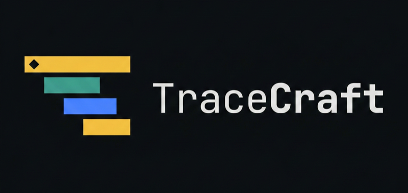
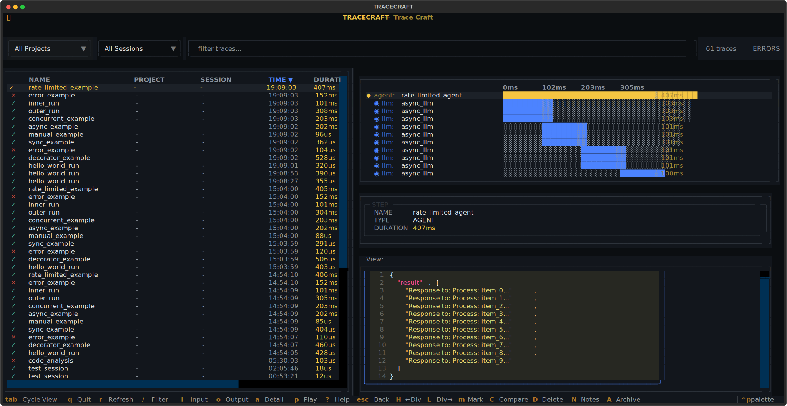
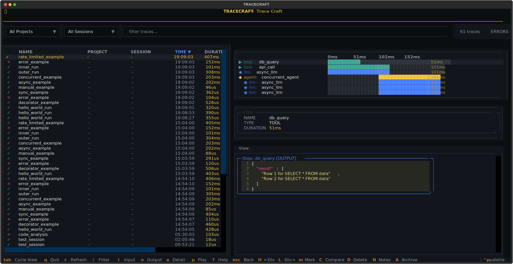
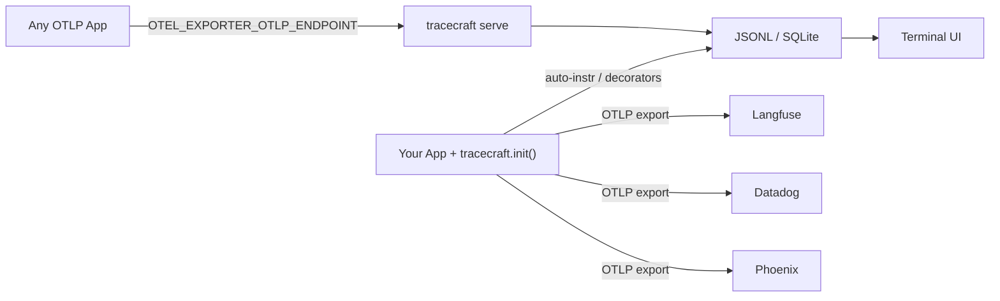

<p align="center">
  
</p>

# TraceCraft

**Vendor-neutral LLM observability — instrument once, observe anywhere.**

TraceCraft is a Python observability SDK with a built-in **Terminal UI (TUI)** that lets you visually explore, debug, and analyze your agent traces right in your terminal — no browser, no cloud dashboard, no waiting.

---

## The fastest path: zero code changes

If your app already uses OpenAI, Anthropic, LangChain, LlamaIndex, or any OpenTelemetry-compatible framework, TraceCraft can observe it **without touching a single line of application code**.

**Step 1 — Install and set one environment variable:**

```bash
pip install "tracecraft[receiver,tui]"

export OTEL_EXPORTER_OTLP_ENDPOINT=http://localhost:4318
```

**Step 2 — Start the receiver and TUI together:**

```bash
tracecraft serve --tui
```

**Step 3 — Run your existing app unchanged:**

```bash
python your_app.py
```

Traces from any OTLP-compatible framework (OpenLLMetry, LangChain, LlamaIndex, DSPy, or any standard OpenTelemetry SDK) stream live into the TUI the moment they arrive. No `init()` call. No decorators. No code changes.

---

## The Terminal UI — Your Agent's Black Box Recorder

After traces are flowing in, the TUI gives you complete visibility into every agent run:



*All your agent runs at a glance — name, duration, token usage, and status. Select any trace to drill down.*

Select any trace to expand the full call hierarchy with timing bars. Navigate to any LLM step and press `i` for the prompt, `o` for the response, or `a` for all span attributes and metadata.



*Hierarchical waterfall view — agents, tools, and LLM calls with precise timing. See exactly where your agent spends its time.*

---

## Path 2 — Config file + one `init()` call

When you want a persistent local setup — custom service name, JSONL export, PII redaction — drop a config file into your project and add one line to your app:

**`.tracecraft/config.yaml`:**

```yaml
# .tracecraft/config.yaml
default:
  exporters:
    receiver: true         # stream to tracecraft serve --tui
  instrumentation:
    auto_instrument: true  # patches OpenAI, Anthropic, LangChain, LlamaIndex
```

**Your app:**

```python
import tracecraft

tracecraft.init()  # reads .tracecraft/config.yaml automatically
```

**Then start the TUI:**

```bash
tracecraft serve --tui
```

Or, if you prefer to write traces to a file and open the TUI separately:

```bash
tracecraft tui
```

!!! tip "Call `tracecraft.init()` before importing any LLM SDK"

    TraceCraft patches SDKs at import time. Import your LLM libraries **after** calling `init()` so the patches apply correctly.

[:octicons-arrow-right-24: Full Configuration Reference](user-guide/configuration.md)

---

## Path 3 — SDK decorators and custom tracing

For fine-grained control — custom span names, explicit inputs/outputs, structured step hierarchies — TraceCraft provides `@trace_agent`, `@trace_tool`, `@trace_llm`, and `@trace_retrieval` decorators, plus a `step()` context manager for inline instrumentation.

[:octicons-arrow-right-24: SDK Guide](getting-started/quickstart.md)

---

## Why TraceCraft?

| Feature | TraceCraft | LangSmith | Langfuse | Phoenix |
|---------|------------|-----------|----------|---------|
| **Terminal UI** | **Yes — built-in** | No | No | No |
| **Zero-Code Instrumentation** | Yes | No | No | No |
| **Vendor Lock-in** | None | LangChain | Langfuse | Arize |
| **Local Development** | Full offline | Cloud required | Self-host | Self-host |
| **OpenTelemetry Native** | Built on OTel | Proprietary | Proprietary | Compatible |
| **PII Redaction** | SDK-level | Backend only | Backend only | Backend only |
| **Cost** | Free & Open Source | Paid tiers | Paid tiers | Paid tiers |

---

## What the TUI Shows You

| View | What You See |
|------|-------------|
| **Trace List** | All agent runs — name, duration, tokens, status, timestamp |
| **Waterfall** | Full call hierarchy with timing bars (agent → tool → LLM) |
| **Input View** | Exact prompts, system messages, and context sent to the model |
| **Output View** | Model responses with token counts and cost estimates |
| **Attributes** | Model parameters, custom metadata, error details |

**Keyboard shortcuts:**

| Key | Action |
|-----|--------|
| `↑` / `↓` | Navigate traces |
| `Enter` | Expand waterfall for selected trace |
| `i` | View input/prompt |
| `o` | View output/response |
| `a` | View attributes |
| `/` | Filter traces |
| `m` + `C` | Mark and compare two traces |
| `p` | Open playground for prompt editing |
| `q` | Quit |

[:octicons-arrow-right-24: Full TUI Guide](user-guide/tui.md)

---

## How It Works



**Path 1 — Zero code changes (OTLP env var):**

1. Set `OTEL_EXPORTER_OTLP_ENDPOINT=http://localhost:4318`
2. `tracecraft serve --tui` — starts receiver on `:4318` and opens TUI
3. Run your existing app — traces appear live as they arrive

**Path 2 — Config file + `init()` call:**

1. Add `.tracecraft/config.yaml` and call `tracecraft.init()` in your app
2. Run your agent — traces go to JSONL/SQLite
3. `tracecraft serve --tui` or `tracecraft tui` to explore

---

## Installation

=== "With TUI (Recommended)"

    ```bash
    pip install "tracecraft[tui]"
    ```

    Includes the Terminal UI for local trace exploration.

=== "With OTLP Receiver + TUI"

    ```bash
    pip install "tracecraft[receiver,tui]"
    ```

    Start `tracecraft serve --tui` and point any OTLP app at `http://localhost:4318`.

=== "With Auto-Instrumentation + TUI"

    ```bash
    pip install "tracecraft[auto,tui]"
    ```

    Auto-instruments OpenAI and Anthropic. Includes the Terminal UI.

=== "With Frameworks"

    ```bash
    # LangChain
    pip install "tracecraft[langchain,tui]"

    # LlamaIndex
    pip install "tracecraft[llamaindex,tui]"

    # All frameworks
    pip install "tracecraft[all]"
    ```

=== "Using uv"

    ```bash
    uv add "tracecraft[auto,tui]"
    ```

---

## Next Steps

<div class="grid cards" markdown>

- :material-monitor:{ .lg .middle } **Terminal UI Guide**

    ---

    Master the TUI — navigation, filtering, comparison, keyboard shortcuts

    [:octicons-arrow-right-24: Terminal UI](user-guide/tui.md)

- :material-clock-fast:{ .lg .middle } **Quick Start**

    ---

    Get running in 5 minutes with instrumentation and the TUI

    [:octicons-arrow-right-24: Quick Start](getting-started/quickstart.md)

- :material-connection:{ .lg .middle } **Integrations**

    ---

    LangChain, LlamaIndex, PydanticAI, Claude SDK adapters

    [:octicons-arrow-right-24: Integrations](integrations/)

- :material-api:{ .lg .middle } **API Reference**

    ---

    Complete API documentation for decorators, exporters, and more

    [:octicons-arrow-right-24: API Reference](api/)

</div>

---

## Community & Support

- **GitHub Issues**: [Report bugs and request features](https://github.com/LocalAI/tracecraft/issues)
- **GitHub Discussions**: [Ask questions and share ideas](https://github.com/LocalAI/tracecraft/discussions)
- **Contributing**: See our [Contributing Guide](contributing.md)

## License

TraceCraft is licensed under the Apache-2.0 License. See [LICENSE](https://github.com/LocalAI/tracecraft/blob/main/LICENSE) for details.
