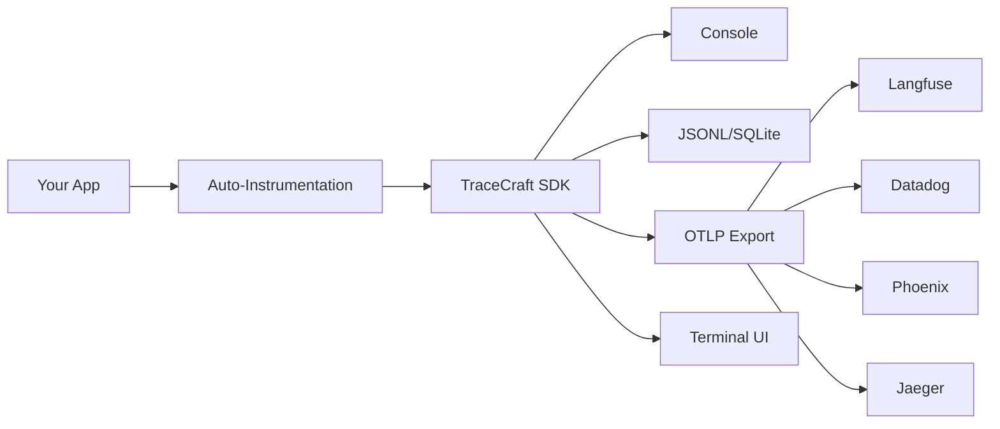

# TraceCraft

**Vendor-neutral LLM observability SDK** - Instrument once, observe anywhere.

TraceCraft is the "LiteLLM for Observability" - a portable Python instrumentation SDK that lets you capture consistent agent/LLM trace semantics and route them to any backend.

---

## Get Started in 30 Seconds

!!! success "Zero Code Changes Required"

    TraceCraft's auto-instrumentation captures every LLM call automatically.
    No decorators. No wrappers. No code changes.

```bash
pip install "tracecraft[auto,tui]"
```

```python
import tracecraft

tracecraft.init(auto_instrument=True)

# Your existing code works unchanged!
```

**That's it.** Every OpenAI and Anthropic call is now traced.

[:octicons-arrow-right-24: Quick Start Guide](getting-started/quickstart.md)

---

## Explore Your Traces Instantly

!!! tip "The TUI Works with ANY OpenTelemetry Data"

    The TraceCraft TUI isn't just for TraceCraft traces. It reads any
    OpenTelemetry-compatible data - OpenLLMetry, Jaeger exports, custom instrumentation.

```bash
tracecraft tui traces/
```

```
┏━━━━━━━━━━━━━━━━━━━━━━━━━━━━━━━━━━━━━━━━━━━━━━━━━━━━━━━━━━━━━━━━━━━━━━━━━━━┓
┃  TraceCraft TUI                                              traces: 47  ┃
┣━━━━━━━━━━━━━━━━━━━━━━━━━━━━━━━━━━━━━━━━━━━━━━━━━━━━━━━━━━━━━━━━━━━━━━━━━━━┫
┃  TRACE ID         NAME                 DURATION    STATUS    TOKENS      ┃
┃  ─────────────────────────────────────────────────────────────────────── ┃
┃▸ abc123...        research_agent       2.34s       ✓         4,521       ┃
┃  def456...        chat.completions     0.89s       ✓         1,247       ┃
┃  ghi789...        rag_query            1.56s       ✗         2,891       ┃
┗━━━━━━━━━━━━━━━━━━━━━━━━━━━━━━━━━━━━━━━━━━━━━━━━━━━━━━━━━━━━━━━━━━━━━━━━━━━┛
┃  research_agent (2.34s)                                                   ┃
┃  ├─ web_search (0.45s)                                                    ┃
┃  └─ chat.completions [gpt-4] (1.89s) ◀─── View prompts, tokens, costs    ┃
┗━━━━━━━━━━━━━━━━━━━━━━━━━━━━━━━━━━━━━━━━━━━━━━━━━━━━━━━━━━━━━━━━━━━━━━━━━━━┛
```

**Features:**

- Hierarchical trace view (agents → tools → LLM calls)
- Search, filter, and compare traces
- View full prompts, completions, and token usage
- Export to JSON, HTML, or clipboard
- Works completely offline

[:octicons-arrow-right-24: Terminal UI Guide](user-guide/tui.md)

---

## Why TraceCraft?

<div class="grid cards" markdown>

- :material-auto-fix:{ .lg .middle } **Zero-Code Instrumentation**

    ---

    Auto-instrument OpenAI, Anthropic, LangChain, and LlamaIndex.
    No decorators or code changes needed.

    [:octicons-arrow-right-24: Auto-Instrumentation](integrations/auto-instrumentation.md)

- :material-monitor:{ .lg .middle } **Powerful Terminal UI**

    ---

    Explore traces interactively. Search, filter, compare.
    Works with ANY OpenTelemetry data.

    [:octicons-arrow-right-24: Terminal UI](user-guide/tui.md)

- :material-lock-open-variant:{ .lg .middle } **No Vendor Lock-in**

    ---

    Export to Langfuse, Datadog, Phoenix, Jaeger, Grafana,
    or any OTLP-compatible backend.

    [:octicons-arrow-right-24: Exporters](user-guide/exporters.md)

- :material-shield-check:{ .lg .middle } **Privacy by Default**

    ---

    PII redaction and client-side sampling built into the SDK.
    Sensitive data never leaves your infrastructure.

    [:octicons-arrow-right-24: Security](user-guide/security.md)

</div>

---

## Comparison

| Feature | TraceCraft | LangSmith | Langfuse | Phoenix |
|---------|------------|-----------|----------|---------|
| **Zero-Code Instrumentation** | Yes | No | No | No |
| **Terminal UI** | Yes | No | No | No |
| **Vendor Lock-in** | None | LangChain | Langfuse | Arize |
| **Framework Support** | All major | LangChain | Multiple | Multiple |
| **Local Development** | Full offline | Cloud required | Self-host | Self-host |
| **OpenTelemetry Native** | Built on OTel | Proprietary | Proprietary | Compatible |
| **PII Redaction** | SDK-level | Backend only | Backend only | Backend only |
| **Cost** | Free & Open Source | Paid tiers | Paid tiers | Paid tiers |

---

## How It Works



1. **Install** TraceCraft with auto-instrumentation
2. **Add two lines** to initialize (no code changes to your app)
3. **Run your app** - all LLM calls are automatically traced
4. **Explore** with the Terminal UI or export to any backend

---

## Installation

=== "Recommended (Auto + TUI)"

    ```bash
    pip install "tracecraft[auto,tui]"
    ```

    Auto-instruments OpenAI and Anthropic. Includes the Terminal UI.

=== "With Frameworks"

    ```bash
    # LangChain
    pip install "tracecraft[langchain,tui]"

    # LlamaIndex
    pip install "tracecraft[llamaindex,tui]"

    # All frameworks
    pip install "tracecraft[all]"
    ```

=== "Using uv"

    ```bash
    uv add "tracecraft[auto,tui]"
    ```

---

## What Gets Captured?

Auto-instrumentation automatically captures:

| SDK | Captured Data |
|-----|---------------|
| **OpenAI** | Chat completions, embeddings, streaming, function calls, token usage |
| **Anthropic** | Messages, streaming, tool use, token counts |
| **LangChain** | Chains, agents, tools, retrievers, LLM calls |
| **LlamaIndex** | Query engines, chat engines, agents, retrievers |

!!! info "Need Custom Instrumentation?"

    Decorators are available if you want to add custom semantic meaning
    to your traces, but they're **completely optional**.

    [:octicons-arrow-right-24: Custom Instrumentation](user-guide/decorators.md)

---

## Export Anywhere

TraceCraft is vendor-neutral. Send traces to any backend:

```python
from tracecraft.exporters import OTLPExporter

tracecraft.init(
    exporters=[
        OTLPExporter(endpoint="http://localhost:4317"),  # Jaeger, Tempo, etc.
    ]
)
```

**Supported backends:**

- Langfuse
- Datadog
- Phoenix (Arize)
- Jaeger
- Grafana Tempo
- Honeycomb
- Any OTLP-compatible system

[:octicons-arrow-right-24: Exporters Guide](user-guide/exporters.md)

---

## Next Steps

<div class="grid cards" markdown>

- :material-clock-fast:{ .lg .middle } **Quick Start**

    ---

    Get running in 2 minutes with auto-instrumentation

    [:octicons-arrow-right-24: Quick Start](getting-started/quickstart.md)

- :material-monitor:{ .lg .middle } **Terminal UI**

    ---

    Explore traces interactively in your terminal

    [:octicons-arrow-right-24: Terminal UI](user-guide/tui.md)

- :material-connection:{ .lg .middle } **Integrations**

    ---

    LangChain, LlamaIndex, PydanticAI adapters

    [:octicons-arrow-right-24: Integrations](integrations/index.md)

- :material-api:{ .lg .middle } **API Reference**

    ---

    Complete API documentation

    [:octicons-arrow-right-24: API Reference](api/index.md)

</div>

---

## Community & Support

- **GitHub Issues**: [Report bugs and request features](https://github.com/LocalAI/tracecraft/issues)
- **GitHub Discussions**: [Ask questions and share ideas](https://github.com/LocalAI/tracecraft/discussions)
- **Contributing**: See our [Contributing Guide](contributing.md)

## License

TraceCraft is licensed under the Apache-2.0 License. See [LICENSE](https://github.com/LocalAI/tracecraft/blob/main/LICENSE) for details.
