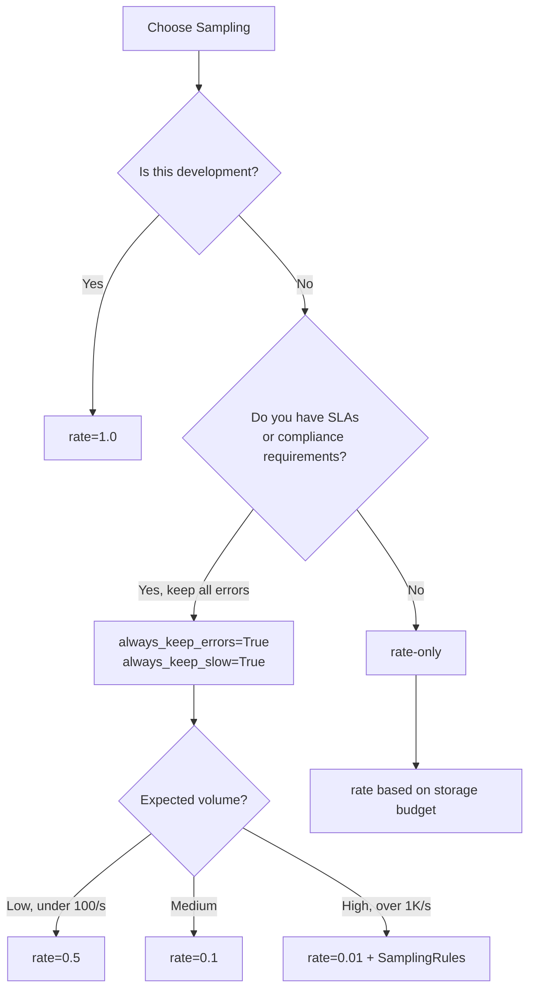

# Quick Reference

This page provides a condensed reference for TraceCraft's most commonly used APIs, configuration options, CLI commands, and patterns. For full documentation, follow the links in each section.

---

## Decorators

All decorators support both synchronous and asynchronous functions. They transparently wrap the function and create a `Step` in the current `AgentRun`.

### @trace_agent

```python
tracecraft.trace_agent(
    name: str | None = None,
    exclude_inputs: list[str] | None = None,
    capture_inputs: bool = True,
    runtime: TALRuntime | None = None,
) -> Callable
```

Creates a step of type `AGENT`. Use for top-level agent entry points.

```python
import tracecraft

@tracecraft.trace_agent(name="research_agent")
def research(query: str) -> str:
    return process(query)

# Async version — same signature
@tracecraft.trace_agent(name="async_agent")
async def async_research(query: str) -> str:
    return await process_async(query)

# Exclude sensitive parameters
@tracecraft.trace_agent(name="auth_agent", exclude_inputs=["api_key"])
def auth_agent(user: str, api_key: str) -> bool:
    return authenticate(user, api_key)
```

### @trace_tool

```python
tracecraft.trace_tool(
    name: str | None = None,
    exclude_inputs: list[str] | None = None,
    capture_inputs: bool = True,
    runtime: TALRuntime | None = None,
) -> Callable
```

Creates a step of type `TOOL`. Use for tool/function calls invoked by an agent.

```python
@tracecraft.trace_tool(name="web_search")
def search(query: str) -> list[str]:
    return fetch_results(query)

@tracecraft.trace_tool(name="db_query", exclude_inputs=["conn_str"])
def query_db(sql: str, conn_str: str) -> list[dict]:
    return execute(sql, conn_str)
```

### @trace_llm

```python
tracecraft.trace_llm(
    name: str | None = None,
    model: str | None = None,
    provider: str | None = None,
    exclude_inputs: list[str] | None = None,
    capture_inputs: bool = True,
    runtime: TALRuntime | None = None,
) -> Callable
```

Creates a step of type `LLM`. Captures model metadata for cost and token tracking.

```python
@tracecraft.trace_llm(name="summarize", model="gpt-4o", provider="openai")
def call_llm(prompt: str) -> str:
    return client.chat.completions.create(...)

# Exclude API key from traces
@tracecraft.trace_llm(model="claude-3-5-sonnet-20241022", provider="anthropic",
                      exclude_inputs=["api_key"])
async def call_claude(prompt: str, api_key: str) -> str:
    return await anthropic_client.messages.create(...)
```

### @trace_retrieval

```python
tracecraft.trace_retrieval(
    name: str | None = None,
    exclude_inputs: list[str] | None = None,
    capture_inputs: bool = True,
    runtime: TALRuntime | None = None,
) -> Callable
```

Creates a step of type `RETRIEVAL`. Use for vector search, document retrieval, or RAG steps.

```python
@tracecraft.trace_retrieval(name="vector_search")
def search_docs(query: str) -> list[dict]:
    return vector_store.search(query)

# Exclude large embedding arrays
@tracecraft.trace_retrieval(name="embedding_search", exclude_inputs=["embedding"])
def search_by_embedding(query: str, embedding: list[float]) -> list[dict]:
    return vector_store.similarity_search(embedding)
```

### @trace_llm_stream

```python
tracecraft.trace_llm_stream(
    name: str | None = None,
    model: str | None = None,
    provider: str | None = None,
    exclude_inputs: list[str] | None = None,
    capture_inputs: bool = True,
    runtime: TALRuntime | None = None,
) -> Callable
```

Wraps async generator functions that yield string tokens. Aggregates the full output and token count after the stream completes.

```python
from tracecraft.instrumentation.decorators import trace_llm_stream

@trace_llm_stream(name="chat_stream", model="gpt-4o", provider="openai")
async def stream_chat(prompt: str):
    async for chunk in client.chat.completions.create(
        model="gpt-4o",
        messages=[{"role": "user", "content": prompt}],
        stream=True,
    ):
        if chunk.choices[0].delta.content:
            yield chunk.choices[0].delta.content
```

### @trace_stream

```python
tracecraft.trace_stream(
    name: str | None = None,
    step_type: StepType = StepType.WORKFLOW,
    exclude_inputs: list[str] | None = None,
    capture_inputs: bool = True,
    runtime: TALRuntime | None = None,
) -> Callable
```

General-purpose streaming decorator for any async generator. Works with any `StepType`.

```python
from tracecraft.instrumentation.decorators import trace_stream
from tracecraft.core.models import StepType

@trace_stream(name="process_stream", step_type=StepType.WORKFLOW)
async def process_items():
    async for item in fetch_items():
        yield transform(item)
```

### step() Context Manager

```python
tracecraft.step(
    name: str,
    type: StepType = StepType.WORKFLOW,
) -> Generator[Step, None, None]
```

Creates a manually controlled step. Use when you cannot use a decorator or need to set custom attributes.

```python
from tracecraft.instrumentation.decorators import step
from tracecraft.core.models import StepType

with step("data_preprocessing", type=StepType.WORKFLOW) as s:
    result = preprocess(raw_data)
    s.outputs["record_count"] = len(result)
    s.attributes["source"] = "s3://bucket/data.csv"
```

---

## Config File

TraceCraft loads `.tracecraft/config.yaml` from the project root (or `~/.tracecraft/config.yaml`) automatically. Explicit `init()` parameters always win.

**Minimal config:**

```yaml
env: development

default:
  service_name: my-agent-service

  exporters:
    console: true
    jsonl: true
    receiver: false                        # true to stream to tracecraft serve --tui
    receiver_endpoint: http://localhost:4318

  instrumentation:
    auto_instrument: false                 # true, or [openai, anthropic]
```

**Per-environment overrides:**

```yaml
environments:
  development:
    exporters:
      receiver: true
    instrumentation:
      auto_instrument: true

  production:
    storage:
      type: none
    exporters:
      console: false
      otlp: true
      otlp_endpoint: ${OTEL_EXPORTER_OTLP_ENDPOINT}
    processors:
      redaction_enabled: true
      sampling_enabled: true
      sampling_rate: 0.1
```

Set environment: `export TRACECRAFT_ENV=production` or `env: production` in the file.

---

## Environment Variables

### Core Variables

| Variable | Type | Default | Description |
|---|---|---|---|
| `TRACECRAFT_SERVICE_NAME` | string | `"tracecraft"` | Service name attached to all traces |
| `TRACECRAFT_ENV` | string | `"development"` | Active environment (maps to config file `environments:` key) |
| `TRACECRAFT_CONSOLE_ENABLED` | bool | `true` | Enable console exporter |
| `TRACECRAFT_JSONL_ENABLED` | bool | `true` | Enable JSONL file exporter |
| `TRACECRAFT_JSONL_PATH` | path | `traces/tracecraft.jsonl` | JSONL output file path |
| `TRACECRAFT_REDACTION_ENABLED` | bool | `true` | Enable PII redaction |

### OTLP Variables

| Variable | Type | Default | Description |
|---|---|---|---|
| `TRACECRAFT_OTLP_ENABLED` | bool | `false` | Enable OTLP exporter |
| `TRACECRAFT_OTLP_ENDPOINT` | URL | — | OTLP collector endpoint |
| `OTEL_EXPORTER_OTLP_ENDPOINT` | URL | — | Standard OTel endpoint (also used) |
| `OTEL_EXPORTER_OTLP_HEADERS` | string | — | Headers as `key=value,key2=value2` |

### Sampling Variables

| Variable | Type | Default | Description |
|---|---|---|---|
| `TRACECRAFT_SAMPLING_RATE` | float | `1.0` | Sampling rate (0.0-1.0) |
| `TRACECRAFT_SAMPLING_KEEP_ERRORS` | bool | `true` | Always keep error traces |
| `TRACECRAFT_ALWAYS_KEEP_SLOW` | bool | `false` | Always keep slow traces |
| `TRACECRAFT_SLOW_THRESHOLD_MS` | float | `5000.0` | Slow trace threshold in ms |

### Auto-Instrumentation

| Variable | Type | Default | Description |
|---|---|---|---|
| `TRACECRAFT_AUTO_INSTRUMENT` | bool or list | — | Enable auto-instrumentation (`true`, `openai,langchain`) |

### Cloud Platform Variables

| Variable | Description |
|---|---|
| `TRACECRAFT_AZURE_FOUNDRY_ENABLED` | Enable Azure AI Foundry export |
| `APPLICATIONINSIGHTS_CONNECTION_STRING` | Azure Application Insights connection string |
| `TRACECRAFT_AWS_AGENTCORE_ENABLED` | Enable AWS AgentCore export |
| `TRACECRAFT_GCP_VERTEX_ENABLED` | Enable GCP Vertex Agent export |
| `GOOGLE_CLOUD_PROJECT` | GCP project ID |

---

## Configuration Options

### TraceCraftConfig

```python
from tracecraft.core.config import TraceCraftConfig, ProcessorOrder

TraceCraftConfig(
    service_name: str = "tracecraft",
    console_enabled: bool = True,
    jsonl_enabled: bool = True,
    jsonl_path: str | Path | None = None,
    tags: list[str] = [],
    processor_order: ProcessorOrder = ProcessorOrder.SAFETY,
    max_step_depth: int | None = 100,
    redaction: RedactionConfig = RedactionConfig(),
    sampling: SamplingConfig = SamplingConfig(),
    exporter: ExporterConfig = ExporterConfig(),
    # Cloud integrations
    azure_foundry: AzureFoundryConfig = AzureFoundryConfig(),
    aws_agentcore: AWSAgentCoreConfig = AWSAgentCoreConfig(),
    gcp_vertex_agent: GCPVertexAgentConfig = GCPVertexAgentConfig(),
)
```

### RedactionConfig

```python
from tracecraft.core.config import RedactionConfig
from tracecraft.processors.redaction import RedactionMode

RedactionConfig(
    enabled: bool = True,                  # Enable PII redaction
    mode: RedactionMode = RedactionMode.MASK,  # MASK, HASH, or REMOVE
    custom_patterns: list[str] = [],       # Additional regex patterns
    allowlist: list[str] = [],             # Values never redacted (exact match)
    allowlist_patterns: list[str] = [],    # Values never redacted (fullmatch regex)
)
```

### SamplingConfig

```python
from tracecraft.core.config import SamplingConfig

SamplingConfig(
    rate: float = 1.0,                    # 0.0-1.0
    always_keep_errors: bool = True,      # Keep all error traces
    always_keep_slow: bool = False,       # Keep all slow traces
    slow_threshold_ms: float = 5000.0,   # Slow threshold in ms
)
```

### ProcessorOrder

```python
from tracecraft.core.config import ProcessorOrder

ProcessorOrder.SAFETY      # Enrich -> Redact -> Sample (default, compliance-safe)
ProcessorOrder.EFFICIENCY  # Sample -> Redact -> Enrich (high-throughput)
```

---

## CLI Commands

All commands are run via `uv run tracecraft` or `tracecraft` if installed globally.

### tui — Interactive Terminal UI

```bash
tracecraft tui [SOURCE] [OPTIONS]

# Open TUI from config-specified storage (default: traces/tracecraft.db)
tracecraft tui

# Start OTLP receiver on :4318 and open TUI
tracecraft tui --serve

# Launch TUI with a JSONL file
tracecraft tui traces/tracecraft.jsonl

# SQLite database
tracecraft tui traces.db
tracecraft tui sqlite:///path/to/traces.db

# MLflow experiment
tracecraft tui mlflow:my_experiment
tracecraft tui mlflow://localhost:5000/production_traces

# Watch mode (live updates)
tracecraft tui traces.jsonl --watch

# Use environment config
tracecraft tui --env production

Options:
  --watch, -w     Watch for new traces
  --env, -e       Use storage from environment config
  --filter, -f    Initial filter string
  --serve, -S     Start OTLP receiver on :4318 before opening TUI
```

### serve — OTLP Receiver with Optional TUI

```bash
tracecraft serve [OPTIONS]

# Start receiver (default: port 4318, SQLite storage)
tracecraft serve

# Start receiver and open TUI
tracecraft serve --tui

# Custom port and storage
tracecraft serve --port 4317 --storage my_traces.db

# JSONL storage
tracecraft serve --storage traces.jsonl

Options:
  --port, -p      Port to listen on (default: 4318)
  --host, -H      Host to bind to (default: 0.0.0.0)
  --storage, -s   Storage path (.db or .jsonl)
  --tui, -t       Launch TUI alongside receiver
  --watch, -w     Watch for new traces in TUI
```

### receive — Headless OTLP Receiver

```bash
tracecraft receive [OPTIONS]

tracecraft receive
tracecraft receive --port 4317 --storage traces/production.db

Options:
  --port, -p      Port to listen on (default: 4318)
  --host, -H      Host to bind to (default: 0.0.0.0)
  --storage, -s   Storage path (default: traces/tracecraft.db)
```

### view — View Traces from File

```bash
tracecraft view FILE [OPTIONS]

# Tree view of all traces
tracecraft view traces.jsonl

# Specific run by index
tracecraft view traces.jsonl --run 0

# JSON output
tracecraft view traces.jsonl --json

Options:
  --run, -r       Show specific run by index (0-based)
  --json, -j      Output as JSON
```

### stats — Trace Statistics

```bash
tracecraft stats FILE

tracecraft stats traces/tracecraft.jsonl
```

Displays: total runs, total tokens, avg/min/max duration, total steps, total errors.

### export — Export Traces to Formats

```bash
tracecraft export FILE [OPTIONS]

# Export to HTML
tracecraft export traces.jsonl --format html --output report.html

Options:
  --output, -o    Output file path
  --format, -f    Output format (currently: html)
```

### query — Query Traces from Storage

```bash
tracecraft query SOURCE [OPTIONS]

# Find expensive traces
tracecraft query traces.db --min-cost 0.10

# Find error traces
tracecraft query mlflow:production --error

# Filter by name
tracecraft query traces.db --name "research_agent" --limit 20

# Raw SQL (SQLite only)
tracecraft query traces.db --sql "SELECT name, total_cost_usd FROM traces ORDER BY total_cost_usd DESC LIMIT 5"

# MLflow filter DSL
tracecraft query mlflow:production --mlflow-filter "metrics.duration_ms > 5000"

# Output formats
tracecraft query traces.db --format json
tracecraft query traces.db --format csv

Options:
  --sql           Raw SQL query (SQLite only)
  --mlflow-filter MLflow filter DSL (MLflow only)
  --error         Filter traces with errors
  --no-error      Filter traces without errors
  --min-cost      Minimum cost in USD
  --max-cost      Maximum cost in USD
  --min-duration  Minimum duration in ms
  --name, -n      Filter by name (substring match)
  --limit, -l     Max results (default: 10)
  --format, -f    Output format: table, json, csv
```

### validate — Validate a Trace File

```bash
tracecraft validate FILE

tracecraft validate traces/tracecraft.jsonl
# Output: Valid: 42 trace(s) validated successfully
```

### playground — Replay and Compare LLM Steps

```bash
tracecraft playground FILE --trace-id ID [OPTIONS]

# Replay an LLM step
tracecraft playground traces.jsonl --trace-id abc-123 --step-name summarize

# Compare original vs. modified prompt
tracecraft playground traces.jsonl --trace-id abc-123 --step-name summarize \
  --prompt "Summarize in 3 bullet points" --compare

Options:
  --trace-id, -t  Trace ID to replay (required)
  --step-id, -s   Step ID to replay
  --step-name, -n Step name to replay
  --prompt, -p    Modified system prompt
  --compare, -c   Compare original vs. modified output
  --json, -j      Output as JSON
```

---

## Step Types

| Step Type | Constant | Use Case |
|---|---|---|
| Agent | `StepType.AGENT` | Top-level agent invocation; the root of a trace |
| LLM | `StepType.LLM` | LLM API call (chat, completion, embedding) |
| Tool | `StepType.TOOL` | Tool or function invoked by the agent |
| Retrieval | `StepType.RETRIEVAL` | Vector search, document retrieval, RAG fetch |
| Memory | `StepType.MEMORY` | Memory read or write operation |
| Guardrail | `StepType.GUARDRAIL` | Safety check, content moderation |
| Evaluation | `StepType.EVALUATION` | Scoring or judging LLM output quality |
| Workflow | `StepType.WORKFLOW` | Logical grouping of steps (default for `step()`) |
| Error | `StepType.ERROR` | Explicit error step |

---

## Common Patterns

### Basic Setup (Live TUI)

```python
import tracecraft

# Stream traces live to tracecraft serve --tui
runtime = tracecraft.init(
    auto_instrument=True,
    receiver=True,
    service_name="my-agent",
)

# All LLM calls traced automatically — decorators optional
@tracecraft.trace_agent(name="my_agent")
def my_agent(query: str) -> str:
    result = call_llm(query)
    return result

@tracecraft.trace_llm(name="call_llm", model="gpt-4o", provider="openai")
def call_llm(prompt: str) -> str:
    return openai_client.chat.completions.create(...)
```

```bash
tracecraft serve --tui
```

### Basic Setup (File-Based TUI)

```python
import tracecraft

runtime = tracecraft.init(auto_instrument=True, jsonl=True)
```

```bash
tracecraft tui
```

### Production Setup

```python
import tracecraft
from tracecraft.core.config import TraceCraftConfig, SamplingConfig, ProcessorOrder
from tracecraft.exporters.otlp import OTLPExporter
from tracecraft.exporters.async_pipeline import AsyncBatchExporter

config = TraceCraftConfig(
    service_name="my-service",
    sampling=SamplingConfig(rate=0.1, always_keep_errors=True),
    processor_order=ProcessorOrder.EFFICIENCY,
)

batch = AsyncBatchExporter(
    exporter=OTLPExporter(endpoint="http://collector:4317"),
    batch_size=50,
    flush_interval_seconds=5.0,
)

runtime = tracecraft.init(console=False, jsonl=False, exporters=[batch], config=config)
```

### RAG Pattern

```python
import tracecraft
from tracecraft.instrumentation.decorators import step
from tracecraft.core.models import StepType

@tracecraft.trace_agent(name="rag_agent")
async def rag_agent(question: str) -> str:
    docs = await retrieve_docs(question)
    answer = await generate_answer(question, docs)
    return answer

@tracecraft.trace_retrieval(name="retrieve_docs")
async def retrieve_docs(query: str) -> list[dict]:
    embedding = await get_embedding(query)
    return await vector_store.search(embedding, top_k=5)

@tracecraft.trace_llm(name="generate_answer", model="gpt-4o", provider="openai")
async def generate_answer(question: str, context: list[dict]) -> str:
    return await llm_client.complete(question, context)
```

### Multi-Agent Pattern

```python
import tracecraft

@tracecraft.trace_agent(name="orchestrator")
async def orchestrator(task: str) -> str:
    plan = await planner(task)
    results = []
    for step_desc in plan.steps:
        result = await worker_agent(step_desc)
        results.append(result)
    return synthesizer(results)

@tracecraft.trace_agent(name="planner")
async def planner(task: str) -> Plan:
    ...

@tracecraft.trace_agent(name="worker_agent")
async def worker_agent(instruction: str) -> str:
    ...
```

### Excluding Sensitive Data

```python
import tracecraft

# Method 1: Exclude specific parameters
@tracecraft.trace_tool(name="payment", exclude_inputs=["card_number", "cvv"])
def charge_card(amount: float, card_number: str, cvv: str) -> bool:
    return payment_gateway.charge(amount, card_number, cvv)

# Method 2: Capture no inputs at all
@tracecraft.trace_tool(name="auth", capture_inputs=False)
def authenticate(username: str, password: str) -> bool:
    return auth_service.verify(username, password)

# Method 3: Manual step with selective output
from tracecraft.instrumentation.decorators import step
from tracecraft.core.models import StepType

with step("process_user_data", type=StepType.WORKFLOW) as s:
    result = process_sensitive(user_data)
    s.outputs["record_count"] = len(result)  # Only attach summary
    # Never attach the raw user data
```

### Custom Exporter Stack

```python
import tracecraft
from tracecraft.exporters.otlp import OTLPExporter
from tracecraft.exporters.async_pipeline import AsyncBatchExporter, AsyncExporter
from tracecraft.exporters.rate_limited import RateLimitedExporter
from tracecraft.exporters.retry import RetryExporter

otlp = OTLPExporter(endpoint="http://collector:4317")

# Stack: retry -> rate-limit -> batch -> OTLP
pipeline = AsyncBatchExporter(
    exporter=RateLimitedExporter(
        exporter=RetryExporter(exporter=otlp, max_retries=3),
        rate=100.0,
        burst=20,
    ),
    batch_size=50,
    flush_interval_seconds=5.0,
)

runtime = tracecraft.init(console=False, jsonl=False, exporters=[pipeline])
```

---

## Decision Trees

### Which Decorator Should I Use?

```mermaid
flowchart TD
    A[What are you tracing?] --> B{Function type}
    B -->|Top-level agent| C[@trace_agent]
    B -->|LLM API call| D{Streaming?}
    D -->|No| E[@trace_llm]
    D -->|Yes, yields tokens| F[@trace_llm_stream]
    D -->|Yes, yields any type| G[@trace_stream]
    B -->|Tool or function call| H[@trace_tool]
    B -->|Vector search or RAG| I[@trace_retrieval]
    B -->|Cannot use decorator| J[step() context manager]
    B -->|Grouping multiple steps| J
```

### Which Sampling Strategy Should I Use?



---

## Exporters Summary

| Exporter | Module | Use Case | Requires |
|---|---|---|---|
| `ConsoleExporter` | `tracecraft.exporters.console` | Development, debugging | None (built-in) |
| `JSONLExporter` | `tracecraft.exporters.jsonl` | Local file storage | None (built-in) |
| `OTLPExporter` | `tracecraft.exporters.otlp` | OpenTelemetry backend | `tracecraft[otlp]` |
| `HTMLExporter` | `tracecraft.exporters.html` | Human-readable reports | None (built-in) |
| `MLflowExporter` | `tracecraft.exporters.mlflow` | MLflow experiment tracking | `tracecraft[mlflow]` |
| `AsyncExporter` | `tracecraft.exporters.async_pipeline` | Non-blocking export | None (built-in) |
| `AsyncBatchExporter` | `tracecraft.exporters.async_pipeline` | Batched non-blocking export | None (built-in) |
| `AsyncioExporter` | `tracecraft.exporters.async_pipeline` | asyncio-native export | None (built-in) |
| `RateLimitedExporter` | `tracecraft.exporters.rate_limited` | Token bucket rate limiting | None (built-in) |
| `RetryExporter` | `tracecraft.exporters.retry` | Retry on failure | None (built-in) |

All exporters implement `BaseExporter` with `export(run: AgentRun) -> None` and `close() -> None`.

---

## Imports Quick Reference

```python
# Initialization
import tracecraft
from tracecraft.core.runtime import init, get_runtime, TALRuntime

# Decorators
from tracecraft.instrumentation.decorators import (
    trace_agent,
    trace_tool,
    trace_llm,
    trace_retrieval,
    trace_llm_stream,
    trace_stream,
    step,
)

# Models
from tracecraft.core.models import AgentRun, Step, StepType

# Configuration
from tracecraft.core.config import (
    TraceCraftConfig,
    RedactionConfig,
    SamplingConfig,
    ProcessorOrder,
)

# Redaction
from tracecraft.processors.redaction import (
    RedactionProcessor,
    RedactionRule,
    RedactionMode,
)

# Sampling
from tracecraft.processors.sampling import (
    SamplingProcessor,
    SamplingRule,
    SamplingDecision,
)

# Exporters
from tracecraft.exporters.console import ConsoleExporter
from tracecraft.exporters.jsonl import JSONLExporter
from tracecraft.exporters.otlp import OTLPExporter
from tracecraft.exporters.html import HTMLExporter
from tracecraft.exporters.async_pipeline import (
    AsyncExporter,
    AsyncBatchExporter,
    AsyncioExporter,
)
from tracecraft.exporters.rate_limited import RateLimitedExporter
from tracecraft.exporters.retry import RetryExporter

# Storage
from tracecraft.storage.sqlite import SQLiteTraceStore
from tracecraft.storage.jsonl import JSONLTraceStore
from tracecraft.storage.mlflow import MLflowTraceStore

# Async helpers
from tracecraft.contrib.async_helpers import (
    gather_with_context,
    create_task_with_context,
)

# Adapters
from tracecraft.adapters.langchain import LangChainTraceCraftr
from tracecraft.adapters.pydantic_ai import PydanticAITraceCraftr
from tracecraft.adapters.claude_sdk import ClaudeTraceCraftr
```
