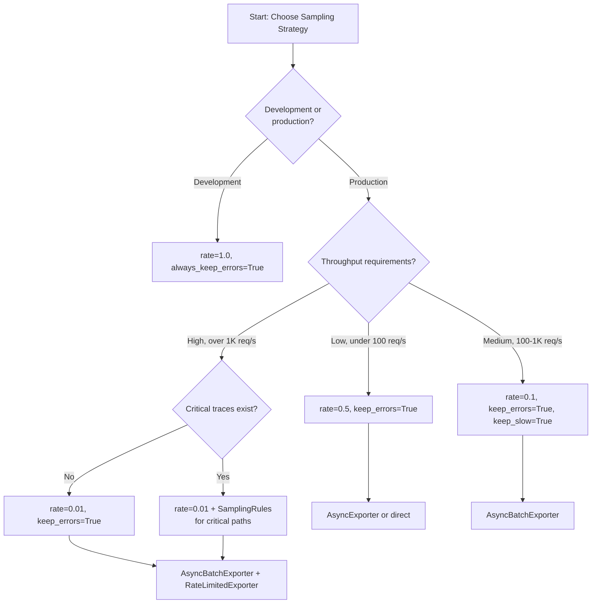

# Performance Guide

TraceCraft is designed to add minimal overhead to your LLM applications. This guide explains how to tune the SDK for your performance requirements, from development setups where you want full observability to high-throughput production environments where every millisecond counts.

---

## Overview

### Why Performance Matters in LLM Observability

LLM calls already carry significant latency (hundreds of milliseconds to multiple seconds). The observability layer should never become the bottleneck. TraceCraft is built with this constraint in mind:

- **Synchronous decorators** add only function-call overhead when processors are bypassed.
- **Processor pipelines** run inline but are short-circuited by sampling so most traces never reach redaction or export.
- **Async exporters** offload network I/O to background threads, keeping decorated functions non-blocking.
- **Batching** amortizes per-export overhead across many traces.

### Expected Overhead by Configuration

| Configuration | Typical Overhead | Best For |
|---|---|---|
| 100% sampling, console + OTLP | 5-10% | Development, debugging |
| 10% sampling, OTLP only | 1-2% | Staging, balanced production |
| 1% sampling, async batch OTLP | <1% | High-throughput production |
| Disabled (sampling_rate=0, keep_errors=True) | <0.1% | Cost-critical production |

### Performance vs. Observability Trade-offs

Every observability decision involves a trade-off:

- **Higher sampling rates** give you more data but cost more in CPU and memory.
- **Redaction** protects PII but adds regex processing per trace.
- **Multiple exporters** multiply export I/O.
- **Async/batch exporters** decouple your application from export latency but introduce queue management complexity.

The sections below guide you through each lever.

---

## Sampling Strategies

Sampling is the highest-impact performance control. Dropping a trace early means no redaction processing, no export I/O, and no storage writes for that trace.

### Rate-Based Sampling

Set `sampling_rate` between `0.0` (drop all) and `1.0` (keep all). The default is `1.0`.

```python
import tracecraft
from tracecraft.core.config import TraceCraftConfig, SamplingConfig

# Keep 10% of traces
runtime = tracecraft.init(
    sampling_rate=0.1,
    config=TraceCraftConfig(
        sampling=SamplingConfig(rate=0.1)
    ),
)
```

Sampling decisions are **deterministic**: the same trace ID always produces the same keep/drop result using a hash of the trace UUID. This means replaying a trace produces the same sampling outcome.

Common rates:

- `1.0` — Keep everything (development)
- `0.5` — Keep 50% (staging)
- `0.1` — Keep 10% (balanced production)
- `0.01` — Keep 1% (high-throughput production)
- `0.0` — Drop all (but errors can still be kept; see below)

### Adaptive Sampling (Smart Defaults)

Rate-based sampling alone risks dropping important traces. Use adaptive flags to ensure critical traces are always preserved.

```python
from tracecraft.core.config import TraceCraftConfig, SamplingConfig

config = TraceCraftConfig(
    sampling=SamplingConfig(
        rate=0.05,                # Keep 5% by default
        always_keep_errors=True,  # Always keep error traces (default: True)
        always_keep_slow=True,    # Always keep slow traces
        slow_threshold_ms=3000.0, # "Slow" = over 3 seconds
    )
)

runtime = tracecraft.init(config=config)
```

**Priority order** when processing a trace:

1. Error traces — kept if `always_keep_errors=True` (checked first)
2. Slow traces — kept if `always_keep_slow=True` and duration exceeds `slow_threshold_ms`
3. Custom rules — first matching rule wins
4. Default rate — applied to all remaining traces

The `always_keep_errors` default is `True`. This means even at `sampling_rate=0.0` you still capture every failure for debugging.

### Custom Sampling Rules

Use `SamplingRule` for fine-grained control based on trace name, tags, duration, or error status.

```python
from tracecraft.processors.sampling import SamplingRule

# Rules are processed in order; first match wins
rules = [
    # Always keep payment processing traces at full rate
    SamplingRule(
        name="payment_full_rate",
        rate=1.0,
        match_names=["process_payment", "refund_payment"],
    ),
    # Sample internal health checks at 1%
    SamplingRule(
        name="health_check_low_rate",
        rate=0.01,
        match_tags=["health_check", "internal"],
    ),
    # Always keep traces with auth errors
    SamplingRule(
        name="auth_errors",
        rate=1.0,
        match_error=True,
        match_tags=["auth"],
    ),
    # Keep traces slower than 10 seconds at full rate
    SamplingRule(
        name="very_slow",
        rate=1.0,
        min_duration_ms=10000.0,
    ),
]
```

`SamplingRule` fields:

| Field | Type | Description |
|---|---|---|
| `name` | `str` | Rule identifier (used in logs) |
| `rate` | `float` | Sampling rate when this rule matches (0.0-1.0) |
| `match_error` | `bool` | Only match traces that have errors |
| `match_names` | `list[str]` | Match by exact run name |
| `match_tags` | `list[str]` | Match if any tag is present |
| `min_duration_ms` | `float \| None` | Minimum duration to match |

### Decision Tree: Which Sampling Strategy?



---

## Batching Configuration

Batching reduces per-export overhead by grouping multiple traces into a single network round-trip or disk write.

### AsyncBatchExporter

`AsyncBatchExporter` wraps any underlying exporter. It buffers traces in memory and flushes when the batch is full or a time interval elapses.

```python
from tracecraft.exporters.otlp import OTLPExporter
from tracecraft.exporters.async_pipeline import AsyncBatchExporter

otlp = OTLPExporter(endpoint="http://otel-collector:4317")

batch_exporter = AsyncBatchExporter(
    exporter=otlp,
    batch_size=50,               # Flush when 50 traces are queued
    flush_interval_seconds=5.0,  # Or after 5 seconds, whichever comes first
    max_queue_size=1000,         # Drop traces if queue exceeds this
    on_error=lambda runs, exc: print(f"Batch failed: {exc}"),
)

runtime = tracecraft.init(
    console=False,
    jsonl=False,
    exporters=[batch_exporter],
)
```

**Parameter guidance:**

| Parameter | Development | Balanced | High-Throughput |
|---|---|---|---|
| `batch_size` | 10 | 50 | 100-500 |
| `flush_interval_seconds` | 1.0 | 5.0 | 10.0-30.0 |
| `max_queue_size` | 100 | 1000 | 5000-10000 |

Always call `batch_exporter.shutdown()` or use it as a context manager to flush remaining traces on exit.

### AsyncExporter

`AsyncExporter` exports each trace individually but in a background thread pool, so your application code never blocks on export I/O.

```python
from tracecraft.exporters.otlp import OTLPExporter
from tracecraft.exporters.async_pipeline import AsyncExporter

otlp = OTLPExporter(endpoint="http://otel-collector:4317")

async_exporter = AsyncExporter(
    exporter=otlp,
    queue_size=1000,  # Max queued traces before dropping
    num_workers=2,    # Background worker threads
    on_error=lambda run, exc: print(f"Export failed for {run.name}: {exc}"),
    on_drop=lambda run: print(f"Queue full, dropped: {run.name}"),
)

runtime = tracecraft.init(exporters=[async_exporter])
```

Use `AsyncExporter` when:

- You need individual trace visibility without batching delay.
- Your downstream exporter is fast but has variable latency (for example, HTTP with retries).
- You want `num_workers > 1` for parallel export throughput.

Use `AsyncBatchExporter` when:

- Your downstream exporter charges per-request (batching reduces cost).
- Network round-trips dominate export time.
- Memory pressure is acceptable in exchange for fewer I/O operations.

### Rate Limiting

`RateLimitedExporter` uses a token bucket algorithm to cap export throughput and protect downstream systems.

```python
from tracecraft.exporters.otlp import OTLPExporter
from tracecraft.exporters.rate_limited import RateLimitedExporter

otlp = OTLPExporter(endpoint="http://otel-collector:4317")

rate_limited = RateLimitedExporter(
    exporter=otlp,
    rate=100.0,     # 100 exports per second steady-state
    burst=20,       # Allow a burst of 20 before throttling
    blocking=False, # Drop excess rather than blocking (recommended for production)
)
```

Combine with `AsyncBatchExporter` for maximum protection:

```python
# Stack: application -> rate limiter -> batch exporter -> OTLP
rate_limited_batch = RateLimitedExporter(
    exporter=AsyncBatchExporter(exporter=otlp, batch_size=50),
    rate=50.0,
    burst=10,
    blocking=False,
)
```

---

## Memory Optimization

### Queue Size Management

Both `AsyncExporter` and `AsyncBatchExporter` use bounded queues. When the queue is full, new traces are dropped and the `on_drop` callback is invoked (if configured). This prevents unbounded memory growth.

Monitor queue pressure with:

```python
stats = async_exporter.get_stats()
print(f"Exported: {stats['exported']}")
print(f"Dropped:  {stats['dropped']}")
print(f"Errors:   {stats['errors']}")

# Check current queue depth
current_depth = async_exporter.queue_size()
print(f"Queue depth: {current_depth}")
```

If `dropped` is non-zero in production, increase `queue_size` or reduce `sampling_rate`.

### Reducing Trace Payload Size

Large trace payloads consume more memory in the queue and more bandwidth during export.

**Option 1: Disable input capture entirely**

```python
import tracecraft

@tracecraft.trace_agent(name="document_processor", capture_inputs=False)
def process_document(text: str) -> str:
    # 'text' might be megabytes; skip capturing it
    return summarize(text)
```

**Option 2: Exclude specific large parameters**

```python
@tracecraft.trace_retrieval(
    name="vector_search",
    exclude_inputs=["embedding"],  # Embeddings are large float arrays
)
def search_by_embedding(query: str, embedding: list[float]) -> list[dict]:
    return vector_store.search(embedding)
```

Excluded parameters appear as `"[EXCLUDED]"` in the trace, preserving the parameter name for debugging while omitting the value.

**Option 3: Attach only summary outputs via context manager**

```python
from tracecraft.instrumentation.decorators import step
from tracecraft.core.models import StepType

with step("process_batch", type=StepType.WORKFLOW) as s:
    result = heavy_processing(large_payload)
    # Only attach the output summary, not the input
    s.outputs["item_count"] = len(result)
    s.outputs["status"] = "success"
```

### Garbage Collection Considerations

TraceCraft holds `AgentRun` objects in memory from `start_run()` until `end_run()` exports and releases them. For long-running agents (minutes or more), keep the following in mind:

- Large `inputs` and `outputs` dicts are held for the full run duration.
- Deeply nested step hierarchies (many children) can accumulate significant memory.
- Use `max_step_depth` in `TraceCraftConfig` to limit hierarchy traversal depth (default: 100).

```python
from tracecraft.core.config import TraceCraftConfig

config = TraceCraftConfig(
    max_step_depth=20,  # Limit step hierarchy to 20 levels
)
```

---

## Async vs. Sync Tracing

### When to Use Async

TraceCraft's decorators transparently support both synchronous and asynchronous functions. The `@trace_agent`, `@trace_tool`, `@trace_llm`, and `@trace_retrieval` decorators detect `asyncio.iscoroutinefunction` at decoration time and wrap accordingly.

```python
# Synchronous — works directly
@tracecraft.trace_tool(name="db_query")
def fetch_record(id: str) -> dict:
    return db.get(id)

# Asynchronous — also works directly
@tracecraft.trace_tool(name="async_db_query")
async def fetch_record_async(id: str) -> dict:
    return await db.get_async(id)
```

Use the async path whenever your application is already async. The overhead is identical in both cases.

### Context Propagation Across Async Boundaries

Python's `contextvars` (which TraceCraft uses internally) do **not** automatically propagate across `asyncio.gather()` or `asyncio.create_task()`. Each new task gets an independent copy of the context at creation time. For most simple cases this is fine, but for complex fan-out patterns use the helpers from `tracecraft.contrib.async_helpers`.

```python
from tracecraft.contrib.async_helpers import gather_with_context

@tracecraft.trace_agent(name="parallel_agent")
async def parallel_agent(queries: list[str]) -> list[str]:
    # gather_with_context propagates the current run/step context
    # to all tasks so their child steps appear under the correct parent
    results = await gather_with_context(
        *[process_query(q) for q in queries]
    )
    return results

@tracecraft.trace_tool(name="process_query")
async def process_query(query: str) -> str:
    return await llm_call(query)
```

Without `gather_with_context`, steps created inside spawned tasks would not be attached to the parent agent step in the trace hierarchy.

---

## Processor Pipeline Optimization

### ProcessorOrder.SAFETY vs. ProcessorOrder.EFFICIENCY

The processor pipeline runs every trace through three stages: enrichment, redaction, and sampling. The order of these stages is configurable.

```python
from tracecraft.core.config import TraceCraftConfig, ProcessorOrder

# SAFETY (default): Enrich -> Redact -> Sample
# Every trace is redacted before sampling decides to keep or drop it.
# Best for compliance environments where PII must never reach a sampler.
config = TraceCraftConfig(
    processor_order=ProcessorOrder.SAFETY,
)

# EFFICIENCY: Sample -> Redact -> Enrich
# Sampling runs first; dropped traces skip redaction entirely.
# Best for cost-sensitive, high-throughput deployments where most traces
# are dropped and you want to minimize CPU time on those traces.
config = TraceCraftConfig(
    processor_order=ProcessorOrder.EFFICIENCY,
)
```

**When to use EFFICIENCY:**

- Sampling rate is low (below 10%) so most traces are dropped.
- Redaction is CPU-intensive (many custom patterns).
- You are confident sampled traces can contain PII before they reach exporters (for example, the OTLP endpoint is internal-only).

**When to use SAFETY (default):**

- Compliance requirements mandate redaction before any data handling.
- Sampling rate is high (above 50%) so the cost difference is small.
- You send traces to external endpoints and cannot risk PII exposure.

### Minimizing Redaction Overhead

Redaction applies regex patterns to every string value in the trace dict recursively. For traces with large text fields, this can add measurable latency.

Strategies to reduce redaction overhead:

1. **Disable default patterns you do not need.** Build a custom `RedactionProcessor` with `include_defaults=False` and only the patterns relevant to your data.

2. **Use field-based rules instead of pattern-scanning.** Field paths skip regex scanning the entire value:

    ```python
    from tracecraft.processors.redaction import RedactionRule, RedactionProcessor

    # Redact the 'api_key' field everywhere without scanning its content
    field_rule = RedactionRule(
        name="api_key_field",
        field_paths=["api_key", "credentials.api_key"],
    )

    processor = RedactionProcessor(
        include_defaults=True,
        rules=[field_rule],
    )
    ```

3. **Use `capture_inputs=False`** for steps where inputs are known to contain large safe text (for example, document content). No content means nothing to redact.

---

## Overhead Measurement

### Built-in Statistics

The `AsyncExporter` and `AsyncBatchExporter` expose counters you can scrape for monitoring:

```python
stats = async_exporter.get_stats()
# AsyncExporter returns:
# {"exported": 1240, "dropped": 3, "errors": 0}

stats = batch_exporter.get_stats()
# AsyncBatchExporter returns:
# {"batches_exported": 25, "runs_exported": 1240, "dropped": 0, "errors": 0}

pending = batch_exporter.pending_count()
# Number of traces waiting in queue + current batch
```

### Health Checks

`AsyncExporter` provides a health check combining worker status and queue saturation:

```python
is_ok = async_exporter.is_healthy()
# True if: at least one worker thread is alive AND queue is below 90% capacity
```

Use this in liveness/readiness probes:

```python
from fastapi import FastAPI

app = FastAPI()

@app.get("/health")
def health():
    if not async_exporter.is_healthy():
        return {"status": "degraded", "reason": "trace export queue saturated"}
    return {"status": "ok"}
```

### RateLimitedExporter Drop Counter

```python
dropped = rate_limited_exporter.dropped_count
print(f"Rate-limited drops: {dropped}")
```

---

## Benchmarks

The following figures are representative estimates measured against a local OTLP collector over a 1 Gbps LAN. Actual numbers depend on trace payload size, processor configuration, and infrastructure.

| Configuration | Overhead | Max Throughput | Queue Memory |
|---|---|---|---|
| 100% sampling, console + OTLP, sync | ~5-10% | ~1K traces/s | ~100 MB |
| 10% sampling, OTLP only, AsyncExporter | ~1-2% | ~10K traces/s | ~50 MB |
| 1% sampling, OTLP, AsyncBatchExporter (batch=100) | <1% | ~50K+ traces/s | ~25 MB |
| 0% sampling (errors only), no export | <0.1% | Effectively unlimited | ~5 MB |

"Overhead" is measured as the percentage increase in end-to-end latency for a traced function that itself takes 100ms. For LLM calls (500ms-5s), the absolute overhead is the same but the percentage impact is proportionally smaller.

---

## Production Configuration Examples

### Minimal Overhead Setup

Optimized for maximum throughput with error visibility preserved.

```python
import tracecraft
from tracecraft.core.config import TraceCraftConfig, SamplingConfig, ProcessorOrder
from tracecraft.exporters.otlp import OTLPExporter
from tracecraft.exporters.async_pipeline import AsyncBatchExporter

otlp = OTLPExporter(
    endpoint="http://otel-collector:4317",
    headers={"Authorization": "Bearer my-token"},
)

batch = AsyncBatchExporter(
    exporter=otlp,
    batch_size=100,
    flush_interval_seconds=10.0,
    max_queue_size=5000,
)

config = TraceCraftConfig(
    service_name="my-production-service",
    sampling=SamplingConfig(
        rate=0.01,               # 1% of normal traces
        always_keep_errors=True, # All errors captured
        always_keep_slow=True,
        slow_threshold_ms=5000.0,
    ),
    processor_order=ProcessorOrder.EFFICIENCY,  # Sample first
)

runtime = tracecraft.init(
    console=False,
    jsonl=False,
    exporters=[batch],
    config=config,
)
```

### Balanced Setup

A good default for most production workloads.

```python
import tracecraft
from tracecraft.core.config import TraceCraftConfig, SamplingConfig, RedactionConfig
from tracecraft.processors.redaction import RedactionMode
from tracecraft.exporters.otlp import OTLPExporter
from tracecraft.exporters.async_pipeline import AsyncBatchExporter

config = TraceCraftConfig(
    service_name="my-service",
    sampling=SamplingConfig(
        rate=0.1,
        always_keep_errors=True,
        always_keep_slow=True,
        slow_threshold_ms=3000.0,
    ),
    redaction=RedactionConfig(
        enabled=True,
        mode=RedactionMode.MASK,
    ),
)

otlp = OTLPExporter(endpoint="http://otel-collector:4317")
batch = AsyncBatchExporter(exporter=otlp, batch_size=50, flush_interval_seconds=5.0)

runtime = tracecraft.init(
    console=False,
    jsonl=True,         # Local JSONL backup
    exporters=[batch],
    config=config,
)
```

### Maximum Observability Setup

For development, debugging, or post-incident analysis.

```python
import tracecraft
from tracecraft.core.config import TraceCraftConfig, SamplingConfig

config = TraceCraftConfig(
    service_name="my-service-debug",
    sampling=SamplingConfig(
        rate=1.0,  # Keep everything
        always_keep_errors=True,
    ),
)

runtime = tracecraft.init(
    console=True,         # Print to terminal
    console_verbose=True, # Include full inputs/outputs
    jsonl=True,
    config=config,
)
```

---

## Troubleshooting

### High Memory Usage

**Symptoms:** Process RSS grows continuously; OOM kills in production.

**Checklist:**

- Check `async_exporter.queue_size()`. If the queue is near `max_queue_size`, the consumer is slower than the producer. Reduce `sampling_rate` or increase worker threads (`num_workers`).
- Check for large inputs captured on every trace. Use `capture_inputs=False` or `exclude_inputs` on decorators for large payloads.
- Check `max_step_depth`. Deeply nested step hierarchies are held in memory for the full run duration.
- Verify `shutdown()` is called at process exit to flush queues and release resources.

### Dropped Traces

**Symptoms:** `stats['dropped']` is non-zero; gaps in trace data.

**Checklist:**

- Increase `max_queue_size` in `AsyncExporter` or `AsyncBatchExporter`.
- Increase `num_workers` in `AsyncExporter` to speed up consumption.
- Reduce `batch_size` to flush more frequently (at the cost of more OTLP requests).
- Reduce `sampling_rate` to produce fewer traces upstream.
- If using `RateLimitedExporter` with `blocking=False`, check `dropped_count`. The downstream may be saturated.

### High Export Latency

**Symptoms:** Application latency spikes correlated with export operations.

**Checklist:**

- Ensure you are using `AsyncExporter` or `AsyncBatchExporter`. Synchronous export blocks the calling thread.
- Check network latency to the OTLP endpoint; consider co-locating a local collector.
- Use `ProcessorOrder.EFFICIENCY` to skip redaction for dropped traces.
- Verify the OTLP endpoint TLS handshake is not adding latency on every request; use persistent connections.

### Export Failures

**Symptoms:** `stats['errors']` grows; traces not appearing in backend.

**Checklist:**

- Verify connectivity to the OTLP endpoint.
- Confirm authentication headers are correct.
- Use `RetryExporter` (from `tracecraft.exporters.retry`) to wrap flaky exporters with automatic retry and backoff.
- Enable debug logging: `logging.getLogger("tracecraft").setLevel(logging.DEBUG)`.
