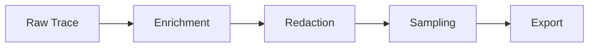

# Processors

Processors transform trace data before export. Trace Craft includes built-in processors for PII redaction, sampling, and enrichment.

## Overview

Processors form a pipeline that processes each trace:



## Built-In Processors

| Processor | Purpose | Enabled by Default |
|-----------|---------|-------------------|
| EnrichmentProcessor | Add metadata | Yes |
| RedactionProcessor | Remove PII | Yes |
| SamplingProcessor | Control volume | No (100% sampling) |

## PII Redaction

Remove sensitive information from traces.

### Basic Usage

```python
from tracecraft.processors.redaction import RedactionProcessor, RedactionMode

processor = RedactionProcessor(
    mode=RedactionMode.MASK,  # or REMOVE, HASH
    enabled=True,
)
```

### Redaction Modes

**MASK** - Replace with placeholder:

```python
mode=RedactionMode.MASK
# "My email is john@example.com" → "My email is [EMAIL_REDACTED]"
```

**REMOVE** - Remove entirely:

```python
mode=RedactionMode.REMOVE
# "My SSN is 123-45-6789" → "My SSN is "
```

**HASH** - Deterministic hash:

```python
mode=RedactionMode.HASH
# "john@example.com" → "a3c7b9d8..."
```

### Built-In Patterns

Trace Craft redacts common PII:

- Email addresses
- Phone numbers
- Credit card numbers
- Social Security Numbers
- IP addresses
- API keys (common patterns)

### Custom Patterns

Add domain-specific patterns:

```python
from tracecraft.processors.redaction import RedactionProcessor

processor = RedactionProcessor(
    custom_patterns=[
        (r"\b[A-Z]{2}\d{6}\b", "[EMPLOYEE_ID]"),  # Employee IDs
        (r"\bCUST-\d{8}\b", "[CUSTOMER_ID]"),     # Customer IDs
        (r"\bAPI-[A-Za-z0-9]{32}\b", "[API_KEY]"), # API keys
    ]
)
```

### Allowlist

Exclude specific patterns from redaction:

```python
processor = RedactionProcessor(
    allowlist=[
        "support@example.com",  # Public support email
        "555-0100",             # Example phone number
    ]
)
```

### Configuration

```python
tracecraft.init(
    enable_pii_redaction=True,
    redaction_mode=RedactionMode.MASK,
    redaction_patterns=[
        (r"\b\d{3}-\d{2}-\d{4}\b", "[SSN]"),
    ]
)
```

## Sampling

Control trace volume by sampling.

### Basic Usage

```python
from tracecraft.processors.sampling import SamplingProcessor

processor = SamplingProcessor(
    rate=0.1,  # Keep 10% of traces
)
```

### Smart Sampling

Keep important traces:

```python
processor = SamplingProcessor(
    rate=0.1,                    # Sample 10%
    always_keep_errors=True,     # Always keep errors
    always_keep_slow=True,       # Always keep slow traces
    slow_threshold_ms=5000,      # >5s is slow
)
```

### Head-Based Sampling

Decision made at trace start:

```python
# Consistent sampling per trace
processor = SamplingProcessor(
    rate=0.1,
    head_based=True,  # Sample entire trace or nothing
)
```

### Tail-Based Sampling

Decision made after trace completes:

```python
# Decide after seeing trace
processor = SamplingProcessor(
    rate=0.1,
    head_based=False,  # Can see trace before deciding
    always_keep_errors=True,
)
```

### Configuration

```python
tracecraft.init(
    sampling_rate=0.1,
    always_keep_errors=True,
    always_keep_slow=True,
    slow_threshold_ms=5000,
)
```

## Enrichment

Add metadata to traces.

### Static Attributes

Add constant metadata:

```python
from tracecraft.processors.enrichment import EnrichmentProcessor

processor = EnrichmentProcessor(
    static_attributes={
        "environment": "production",
        "version": "1.0.0",
        "region": "us-west-2",
        "team": "ai-platform",
    }
)
```

### Dynamic Attributes

Add computed metadata:

```python
import os
import socket

processor = EnrichmentProcessor(
    dynamic_attributes={
        "hostname": lambda: socket.gethostname(),
        "process_id": lambda: os.getpid(),
        "timestamp": lambda: datetime.now(UTC).isoformat(),
    }
)
```

### Configuration

```python
tracecraft.init(
    tags=["version:1.0.0", "environment:prod"],
    # Tags are automatically added to all traces
)
```

## Custom Processors

Create your own processor:

```python
from tracecraft.processors.base import BaseProcessor
from tracecraft.core.models import AgentRun

class CustomProcessor(BaseProcessor):
    def process(self, run: AgentRun) -> AgentRun | None:
        """Process a trace.

        Args:
            run: The agent run to process

        Returns:
            Processed run, or None to drop the trace
        """
        # Add custom metadata
        run.metadata["custom_field"] = "value"

        # Modify spans
        for step in run.steps:
            step.attributes["processed"] = True

        # Drop certain traces
        if should_drop(run):
            return None

        return run

# Use it
runtime = tracecraft.get_runtime()
runtime.add_processor(CustomProcessor())
```

## Processor Order

Configure processing order:

```python
from tracecraft.core.config import ProcessorOrder

# SAFETY (default): Enrich → Redact → Sample
# Better for compliance, processes everything
tracecraft.init(processor_order=ProcessorOrder.SAFETY)

# EFFICIENCY: Sample → Redact → Enrich
# Better for performance, processes less data
tracecraft.init(processor_order=ProcessorOrder.EFFICIENCY)
```

**SAFETY Mode:**

1. Enrich all traces
2. Redact PII from all traces
3. Sample (some traces dropped)
4. Export sampled traces

**EFFICIENCY Mode:**

1. Sample first (most traces dropped immediately)
2. Redact PII only from sampled traces
3. Enrich only sampled traces
4. Export

## Pipeline Example

Complete processing pipeline:

```python
from tracecraft import TraceCraftRuntime, TraceCraftConfig
from tracecraft.processors.enrichment import EnrichmentProcessor
from tracecraft.processors.redaction import RedactionProcessor, RedactionMode
from tracecraft.processors.sampling import SamplingProcessor

# Create runtime
config = TraceCraftConfig(processor_order=ProcessorOrder.SAFETY)
runtime = TraceCraftRuntime(config=config)

# Add processors in order
runtime.add_processor(EnrichmentProcessor(
    static_attributes={
        "environment": "production",
        "version": "2.0.0",
    }
))

runtime.add_processor(RedactionProcessor(
    mode=RedactionMode.MASK,
    custom_patterns=[
        (r"\b[A-Z]{2}\d{6}\b", "[ID_REDACTED]"),
    ]
))

runtime.add_processor(SamplingProcessor(
    rate=0.1,
    always_keep_errors=True,
))

# Custom processor
runtime.add_processor(MyCustomProcessor())
```

## Conditional Processing

Process based on trace properties:

```python
class ConditionalProcessor(BaseProcessor):
    def process(self, run: AgentRun) -> AgentRun | None:
        # Different processing for different users
        user_id = run.metadata.get("user_id")

        if user_id in PREMIUM_USERS:
            # Keep 100% for premium users
            return run
        elif run.error:
            # Always keep errors
            return run
        else:
            # Sample 10% for regular users
            if random.random() < 0.1:
                return run
            return None
```

## Performance Considerations

### 1. Use EFFICIENCY Mode for High Volume

```python
# Process less data
tracecraft.init(
    processor_order=ProcessorOrder.EFFICIENCY,
    sampling_rate=0.01,  # Sample first
)
```

### 2. Minimize Redaction Patterns

```python
# Only redact what's necessary
processor = RedactionProcessor(
    custom_patterns=[
        # Only critical patterns
        (r"\b\d{16}\b", "[CC]"),  # Credit cards only
    ]
)
```

### 3. Use Async Processors

```python
class AsyncProcessor(BaseProcessor):
    async def process_async(self, run: AgentRun) -> AgentRun | None:
        # Async processing
        await self.async_operation(run)
        return run
```

## Best Practices

### 1. Always Enable Redaction

```python
# Privacy by default
tracecraft.init(enable_pii_redaction=True)
```

### 2. Use Smart Sampling

```python
# Keep important traces
tracecraft.init(
    sampling_rate=0.1,
    always_keep_errors=True,
    always_keep_slow=True,
)
```

### 3. Add Business Context

```python
# Enrich with business metadata
processor = EnrichmentProcessor(
    static_attributes={
        "customer_tier": "enterprise",
        "feature_flags": ["new_ui", "beta_features"],
    }
)
```

### 4. Test Processors

```python
# Unit test your processors
def test_custom_processor():
    processor = CustomProcessor()
    run = create_test_run()
    result = processor.process(run)
    assert result is not None
    assert "custom_field" in result.metadata
```

## Next Steps

- [Exporters](exporters.md) - Send processed traces to backends
- [Configuration](configuration.md) - Configure processors
- [API Reference](../api/processors.md) - Processor API
