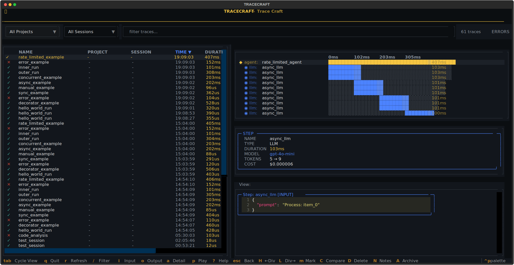
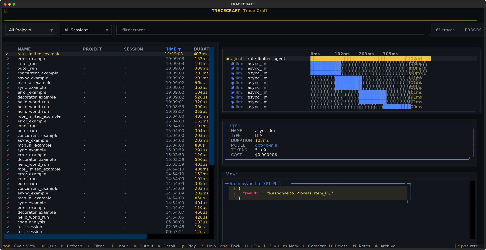
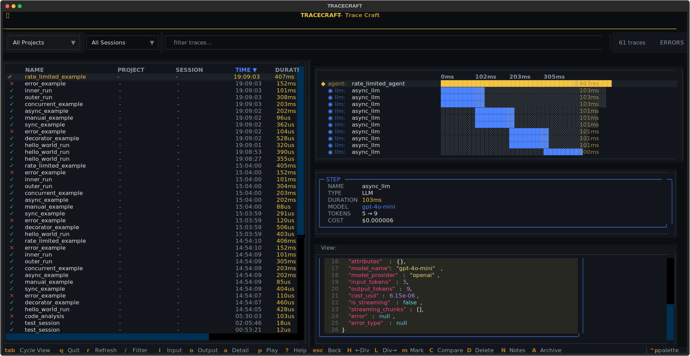
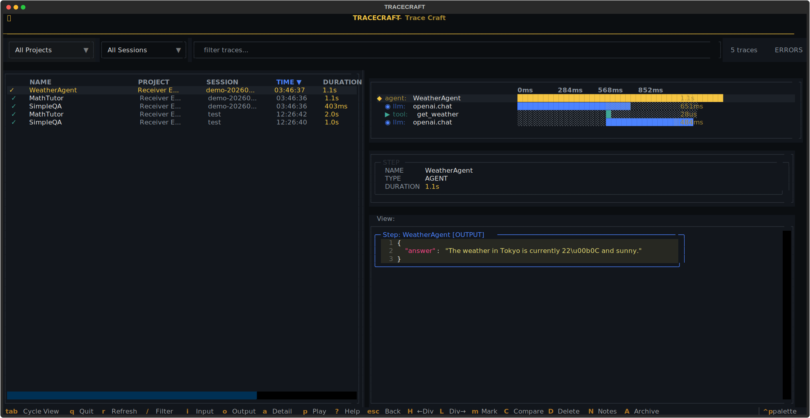
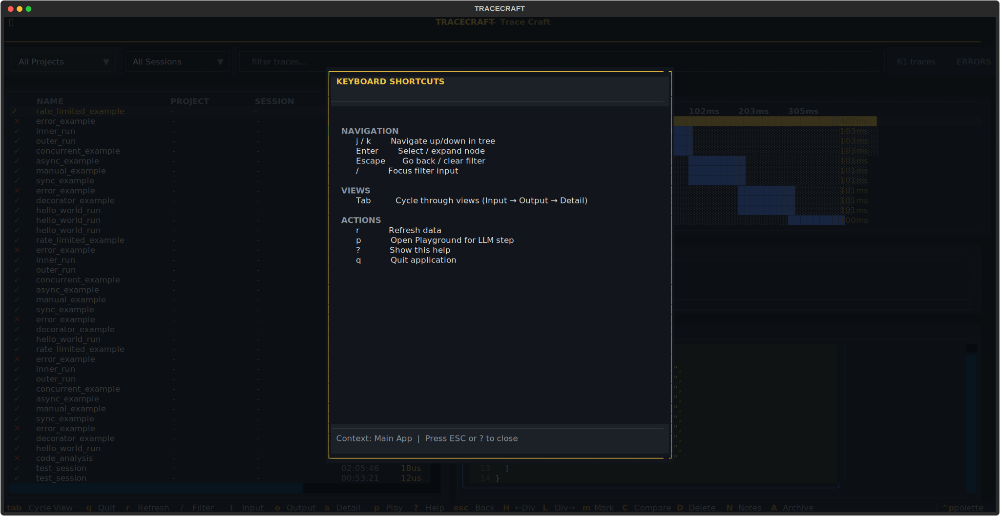
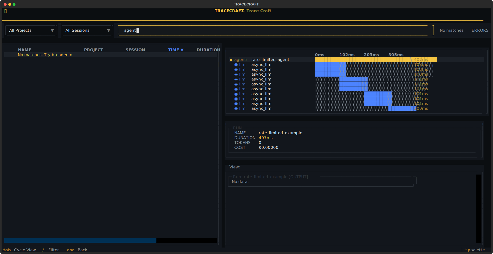
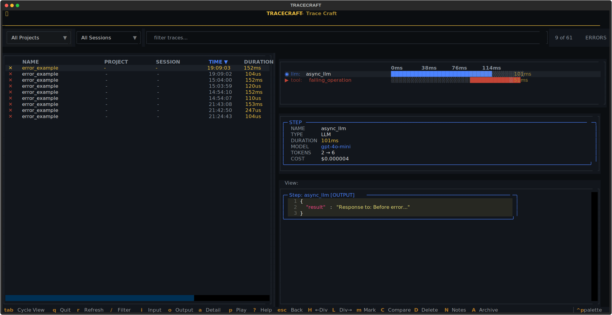
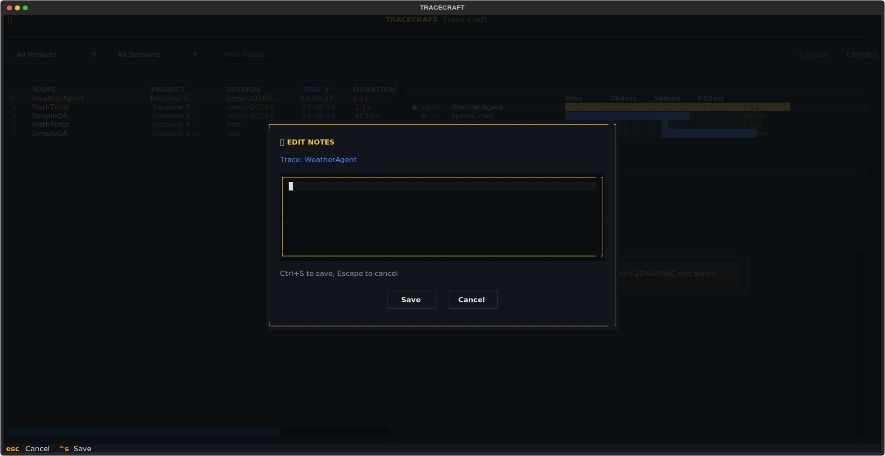

# Terminal UI

The TraceCraft Terminal UI (TUI) is the flagship feature of TraceCraft — a powerful, interactive trace explorer that runs right in your terminal. Analyze LLM traces, debug agent behavior, inspect prompts and responses, compare performance across runs, and understand exactly what your AI application did at every step.

!!! tip "Two Ways to Get Traces into the TUI"

    **Path B — OTLP receiver** (zero code changes — the simplest option):

    ```bash
    tracecraft serve --tui
    ```

    Then point any OTLP-compatible framework at it:

    ```bash
    OTEL_EXPORTER_OTLP_ENDPOINT=http://localhost:4318 python your_app.py
    ```

    Works with OpenLLMetry, LangChain's OTel exporter, LlamaIndex, DSPy, or any standard
    OpenTelemetry SDK. Traces appear live in the TUI as they arrive.

    Or use `tracecraft tui --serve` to start the receiver and open the TUI in one command.

    ---

    **Path A — TraceCraft instrumentation** (you control the code):

    The fastest option is `receiver=True` — one `init()` call, then start the TUI:

    ```python
    import tracecraft

    # Call init() BEFORE importing any LLM SDK
    tracecraft.init(
        auto_instrument=True,   # patches OpenAI, Anthropic, LangChain, LlamaIndex
        receiver=True,          # streams traces to tracecraft serve --tui
        service_name="my-app",
    )

    from openai import OpenAI
    OpenAI().chat.completions.create(...)  # automatically captured and streamed
    ```

    Start the TUI receiver:
    ```bash
    tracecraft serve --tui
    ```

    Or write to JSONL and open the TUI against the file:
    ```python
    tracecraft.init(auto_instrument=True, jsonl=True)
    ```
    ```bash
    tracecraft tui traces/
    ```

    Or use decorators for custom agent/tool spans:
    ```python
    @tracecraft.trace_agent(name="my_agent")
    async def my_agent(query: str) -> str: ...
    ```

!!! note "No-argument shortcut"
    `tracecraft tui` with no arguments reads the storage location from `.tracecraft/config.yaml`
    (defaults to `sqlite://traces/tracecraft.db` if no config is found).

    `tracecraft tui --serve` starts an OTLP receiver on `:4318` and opens the TUI in one step —
    an alternative to running `tracecraft serve --tui` in a separate terminal.

---

## What the TUI Looks Like

### Main View — All Your Agent Runs


*The main view shows all captured agent runs with name, duration, token usage, and status. Navigate with arrow keys. The filter bar at the top lets you search and filter by project or session.*

---

### Waterfall View — Call Hierarchy and Timing

Select any trace and press `Enter` — the waterfall expands to show the complete call tree:


*The waterfall shows agent → tool → LLM call hierarchy with timing bars. See exactly where your agent spends its time.*

---

### Input View — Every Prompt Sent to the Model

Press `i` while viewing any span to see the exact prompt, system message, and context:



*Full prompt inspection — every system message, user message, and context sent to the model.*

---

### Output View — Every Model Response

Press `o` to view the model's complete response:



*Model response with token counts and cost estimates displayed inline.*

---

### Attributes View — Span Metadata and Parameters

Press `a` to view all span attributes — model name, temperature, token counts, costs, and custom metadata:



*All span attributes: model, provider, temperature, token usage, cost, custom metadata, and timing.*

---

## Getting Traces into the TUI

There are two independent paths. Choose the one that fits your setup — or use both.

---

### Path A: TraceCraft Instrumentation

Use this when you own the code. You have three options — auto-instrumentation is the fastest to set up.

#### Option 1 — Auto-Instrument + Stream to TUI in One Call

The `receiver=True` shorthand wires everything up in a single `init()` call: it auto-instruments your LLM SDKs and sends completed traces directly to the TUI receiver over OTLP. No JSONL file, no separate exporter config.

```python
import tracecraft

# Must call init() BEFORE importing any LLM SDK
tracecraft.init(
    auto_instrument=True,      # patches OpenAI, Anthropic, LangChain, LlamaIndex
    receiver=True,             # streams traces to tracecraft serve --tui
    service_name="my-agent",   # optional — appears in the TUI trace list
)

# Now use your SDKs normally
from openai import OpenAI
client = OpenAI()
client.chat.completions.create(...)  # automatically traced and streamed to TUI
```

Start the TUI receiver in a separate terminal:

```bash
tracecraft serve --tui
```

That's the entire setup — two terminal commands, three lines of Python.

**Custom receiver address:**

```python
tracecraft.init(
    auto_instrument=True,
    receiver="http://my-host:4318",  # remote or non-default port
    service_name="my-agent",
)
```

**Combined with other exporters** (receiver + Langfuse/Jaeger at the same time):

```python
from tracecraft.exporters import OTLPExporter

tracecraft.init(
    auto_instrument=True,
    receiver=True,                                          # local TUI
    exporters=[OTLPExporter(endpoint="http://jaeger:4317")],  # also export to Jaeger
    service_name="my-agent",
)
```

[:octicons-arrow-right-24: Full Auto-Instrumentation Guide](../integrations/auto-instrumentation.md)

#### Option 2 — Auto-Instrumentation to JSONL (File-Based)

Write traces to a local JSONL file, then open the TUI against that file:

```python
import tracecraft

# IMPORTANT: call init() before importing any LLM SDK
tracecraft.init(auto_instrument=True, jsonl=True)

from openai import OpenAI
client = OpenAI()
client.chat.completions.create(...)   # automatically traced to JSONL
```

```bash
tracecraft tui traces/   # open TUI against the written file
```

Supports all four frameworks — see the [Auto-Instrumentation Guide](../integrations/auto-instrumentation.md) for per-framework examples.

#### Option 3 — Decorators

For custom agent/tool tracing with rich step names, semantic types, and custom attributes:

```python
import tracecraft
from tracecraft import trace_agent, trace_tool, trace_llm

# Initialize with JSONL or SQLite output
tracecraft.init(jsonl=True)  # or: sqlite=True

@trace_agent(name="research_agent")
async def research(query: str) -> str:
    docs = await retrieve_docs(query)
    return await summarize(docs)

@trace_tool(name="retrieve_docs")
async def retrieve_docs(query: str) -> list[str]:
    return ["doc1", "doc2"]

@trace_llm(name="summarize", model="gpt-4o", provider="openai")
async def summarize(docs: list[str]) -> str:
    ...
```

Run your agent, then:

```bash
tracecraft tui traces/
```

!!! tip "Combine Both"

    Auto-instrumentation and decorators work together — use decorators for agent/orchestration
    spans and auto-instrumentation to capture every underlying LLM call automatically.

#### Option 4 — Framework Adapters

For explicit per-invocation tracing with a LangChain adapter:

```python
import tracecraft
from tracecraft.adapters.langchain import TraceCraftCallbackHandler

tracecraft.init(jsonl=True)

handler = TraceCraftCallbackHandler()
result = chain.invoke({"input": "hello"}, config={"callbacks": [handler]})
```

---

### Path B: OTLP Receiver (`tracecraft serve --tui`)

Use this when you have an existing app using **any OTLP-compatible framework** — OpenLLMetry,
LangChain's OpenTelemetry exporter, LlamaIndex, DSPy, standard OTel SDK, or anything that
speaks OTLP. **No changes to your application code required.**

```bash
# Start the receiver + TUI together
tracecraft serve --tui

# Or start just the receiver (headless), view in TUI separately
tracecraft serve --storage traces/myapp.db
tracecraft tui traces/myapp.db
```

The receiver listens on `http://localhost:4318` (standard OTLP HTTP port). Point your app at it:

```bash
# Any OTLP-instrumented app
OTEL_EXPORTER_OTLP_ENDPOINT=http://localhost:4318 python your_app.py
```

Or configure in code:

```python
# OpenLLMetry example
from opentelemetry.sdk.trace.export import BatchSpanProcessor
from opentelemetry.exporter.otlp.proto.http.trace_exporter import OTLPSpanExporter

tracer_provider.add_span_processor(
    BatchSpanProcessor(OTLPSpanExporter(endpoint="http://localhost:4318/v1/traces"))
)
```

**Supported conventions:**

- OTel GenAI Semantic Conventions (`gen_ai.*` attributes)
- OpenInference Semantic Conventions (`llm.*` attributes — used by LlamaIndex, Phoenix)

Traces appear live in the TUI as they are received (with `--watch` mode enabled by default).

---

## Quick Start

### Installation

=== "Path A — TraceCraft instrumentation"

    ```bash
    pip install "tracecraft[tui]"
    # or with auto-instrumentation:
    pip install "tracecraft[auto,tui]"
    ```

=== "Path B — OTLP receiver"

    ```bash
    pip install "tracecraft[receiver,tui]"
    ```

### Launch

**Path A — after running your TraceCraft-instrumented agent:**

```bash
# Open TUI from config-specified storage (default: traces/tracecraft.db)
tracecraft tui

# From a JSONL file (default output from tracecraft.init(jsonl=True))
tracecraft tui traces/tracecraft.jsonl

# From a SQLite database (richer — supports projects, sessions, notes)
tracecraft tui traces/tracecraft.db

# From a directory (auto-discovers trace files)
tracecraft tui traces/
```

!!! note
    `tracecraft tui` with no arguments reads the storage path from `.tracecraft/config.yaml`.

**Path B — start receiver + TUI together:**

```bash
# Start receiver on :4318 and open TUI (live-updating)
tracecraft serve --tui

# Custom port or storage location
tracecraft serve --tui --port 4317 --storage my_traces.db
```

Then set `OTEL_EXPORTER_OTLP_ENDPOINT=http://localhost:4318` in your app and run it.
Traces appear in the TUI in real-time.

### Loading from SQLite vs JSONL

The TUI supports both JSONL and SQLite storage backends. SQLite enables additional features:



*SQLite view: project and session columns are populated, enabling filtering by project or session. Agent names like "WeatherAgent" and "MathTutor" are shown with full project context.*

Configure SQLite output with:

```python
tracecraft.init(sqlite=True)  # Saves to traces/tracecraft.db
```

---

## Keyboard Shortcuts

All TUI actions are keyboard-driven. Press `?` at any time to show the built-in keyboard shortcut reference:



*The help screen (press `?`) shows all keyboard shortcuts in context.*

### Navigation

| Key | Action |
|-----|--------|
| `↑` / `↓` | Move up/down in the trace list |
| `Enter` | Expand/select trace — shows waterfall |
| `Tab` | Cycle through IO viewer modes (Input → Output → Detail) |
| `Escape` | Collapse waterfall / clear filter |
| `r` | Refresh trace data |

### View Modes

| Key | Action |
|-----|--------|
| `i` | Switch to **Input** view — shows prompts sent to the model |
| `o` | Switch to **Output** view — shows model responses |
| `a` | Switch to **Attributes/Detail** view — shows span metadata |
| `Tab` | Cycle through Input → Output → Detail |

### Search & Filter

| Key | Action |
|-----|--------|
| `/` | Focus the filter bar |
| `Escape` | Clear filter |

### Trace Management

| Key | Action |
|-----|--------|
| `m` | Mark a trace for comparison |
| `C` | Compare marked trace with current trace |
| `V` | View comparison results |
| `D` | Delete current trace (with confirmation) |
| `N` | Edit notes for current trace |
| `A` | Toggle archive status |

### Layout

| Key | Action |
|-----|--------|
| `+` / `=` | Grow waterfall/left panel |
| `-` | Shrink waterfall/left panel |
| `H` / `[` | Shrink left panel (move divider left) |
| `L` / `]` | Grow left panel (move divider right) |

### Other

| Key | Action |
|-----|--------|
| `p` | Open **Playground** — re-run or edit the selected LLM prompt |
| `?` | Show help screen |
| `q` | Quit |

---

## Features in Detail

### Trace List

The trace list shows all captured agent runs at a glance. Each row shows:

- **Name**: The agent or root span name
- **Duration**: Total wall-clock time for the entire trace
- **Tokens**: Total tokens used across all LLM calls in the trace
- **Status**: Success (`✓`), Error (`✗`), or Warning
- **Timestamp**: When the trace was recorded

Navigate with `↑`/`↓`. Press `Enter` to select a trace and expand the waterfall view.

---

### Waterfall View

The waterfall shows the complete call hierarchy for the selected trace. Press `Enter` on any trace to expand it:


- **Agent spans** are shown at the top level
- **Tool calls** are nested under agents
- **LLM calls** are nested under tools or agents
- **Timing bars** show relative duration (█ used, ░ waiting)
- **Token counts** are shown inline for LLM spans

Navigate the waterfall with `↑`/`↓` to select specific spans. Press `i`, `o`, or `a` to inspect the selected span.

---

### Filter Bar

Press `/` to activate the filter bar. Type to filter traces by name or agent:



*Filter bar active with search text typed. The result count updates in real-time.*

Press `Escape` to clear the filter and return to the full trace list.

### Filtering for Errors Only

Click the **ERRORS** toggle button or use the filter dropdown to show only traces with errors:



*Error filter active — shows "9 of 61" matching traces. Error traces are immediately visible for fast debugging.*

This is the fastest way to find and debug failing agent runs.

---

### Input View

Press `i` to view the exact input sent to the selected operation:


- **For LLM spans**: Shows system messages, user messages, and any documents/context
- **For tool spans**: Shows the arguments passed to the tool
- **For agent spans**: Shows the agent's initial input

---

### Output View

Press `o` to view the output from the selected operation:


- **For LLM spans**: Shows the model's response, with token counts and cost estimates
- **For tool spans**: Shows the tool's return value
- **For agent spans**: Shows the agent's final output

---

### Attributes View

Press `a` to see all metadata for the selected span:


- Model name and provider
- Temperature, max tokens, and other LLM parameters
- Token usage breakdown (prompt, completion, total)
- Estimated cost per LLM call
- Custom attributes added via `step.attributes`
- Error messages and stack traces (for failed spans)
- Span timing (start time, end time, duration)

---

### Notes

Press `N` to add notes to any trace (requires SQLite storage):



*Notes editor for the selected trace. Notes persist across TUI sessions in the SQLite database.*

Notes are useful for:

- Annotating interesting or buggy traces for review
- Documenting findings during debugging sessions
- Marking A/B test results

Enable SQLite storage for notes support:

```python
tracecraft.init(sqlite=True)  # Notes require SQLite backend
```

---

### Trace Comparison

Compare two agent runs to understand performance differences:

1. Navigate to the first trace and press `m` to **mark** it
2. Navigate to the second trace and press `C` to **compare**
3. Select a comparison prompt and model in the picker
4. Press `V` to **view comparison results**

Great for:

- A/B testing different prompts or system messages
- Comparing model performance (gpt-4o vs gpt-4o-mini)
- Debugging performance regressions between deployments

---

### Playground

Press `p` on any LLM span to open the **Playground** — an interactive prompt editor that lets you:

- Edit the system prompt or user messages
- Re-run the prompt against any configured model
- See the new response alongside the original
- Iterate on prompts without changing your code

The Playground connects to real LLM APIs, so your TraceCraft API key configuration must be set for the chosen model.

---

## Configuration

### Environment Variables

```bash
# Default trace directory
export TRACECRAFT_TRACES_DIR=./traces

# Color theme (dark, light, auto)
export TRACECRAFT_TUI_THEME=dark
```

### Command Line Options

```bash
tracecraft tui [OPTIONS] [SOURCE]

Options:
  --watch, -w    Watch for new traces in real-time (live mode)
  --serve, -S    Start OTLP receiver on :4318 before opening TUI
  -h, --help     Show help
```

### Live Mode

Watch for new traces as your agent runs:

```bash
tracecraft tui traces/ --watch
```

New traces appear automatically as they're written to disk. This is useful when:

- Running long agent workflows and watching them execute step by step
- Monitoring batch processing jobs in real-time
- Debugging integration tests

---

## Tips & Tricks

### Quick Debugging Workflow

1. Run your agent with `tracecraft.init(jsonl=True)`
2. `tracecraft tui traces/` to launch the TUI
3. Press the **ERRORS** toggle to show only failed traces
4. Press `Enter` on an error trace to expand the waterfall
5. Navigate to the failing span with `↑`/`↓`
6. Press `a` to see the full error message and stack trace

### Finding Slow Operations

1. Launch the TUI and scan the duration column
2. Select a slow trace with `Enter` to open the waterfall
3. Look for the span with the longest timing bar
4. Press `i` to see what prompt caused the long LLM call
5. Press `p` to open Playground and iterate on the prompt

### Cost Analysis

Press `a` on any LLM span to see the cost breakdown:

```
model_name:    gpt-4o-mini
input_tokens:  892
output_tokens: 355
cost_usd:      $0.000147
```

Compare multiple LLM spans in the waterfall to identify the most expensive calls.

### Comparing Runs

1. Mark the baseline run with `m`
2. Navigate to the new run and press `C`
3. Select a comparison model
4. Press `V` to see a diff of the two runs side-by-side

---

## Pulling from Cloud Platforms

The TUI can connect directly to traces stored in AWS X-Ray, GCP Cloud Trace, Azure Monitor, or DataDog — no data migration required.

```bash
# AWS X-Ray (boto3 credential chain)
tracecraft tui xray://us-east-1/my-bedrock-agent

# GCP Cloud Trace (Application Default Credentials)
tracecraft tui cloudtrace://my-gcp-project/my-vertex-agent

# Azure Monitor / Application Insights (DefaultAzureCredential)
tracecraft tui azuremonitor://xxxxxxxx-workspace-id-xxxx/my-ai-foundry-agent

# DataDog APM (DD_API_KEY + DD_APP_KEY env vars)
DD_API_KEY=xxx DD_APP_KEY=yyy tracecraft tui datadog://us1/my-service
```

See the [Remote Trace Sources](remote-trace-sources.md) guide for installation, authentication, config-file usage, and troubleshooting.

---

## Next Steps

- [Decorators](decorators.md) — Instrument custom agents and tools
- [Auto-Instrumentation](../integrations/auto-instrumentation.md) — Zero-code capture for OpenAI/Anthropic
- [Exporters](exporters.md) — Configure where traces are stored
- [Configuration](configuration.md) — Full configuration reference
- [Remote Trace Sources](remote-trace-sources.md) — Pull from X-Ray, Cloud Trace, Azure Monitor, DataDog
